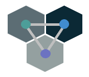
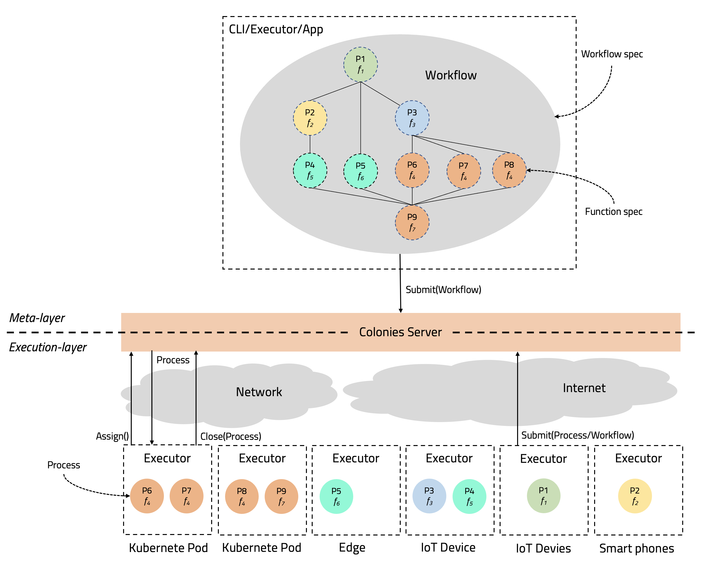
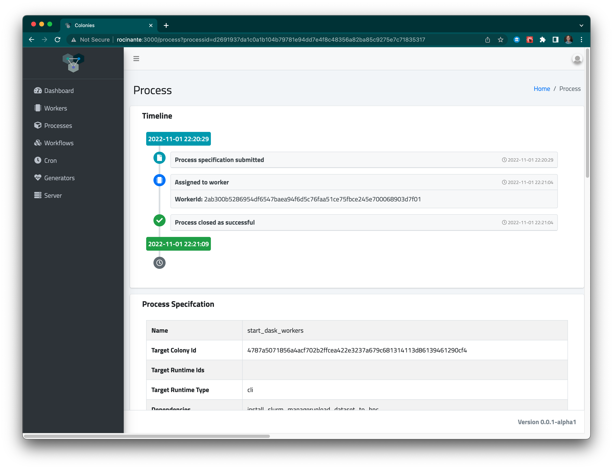
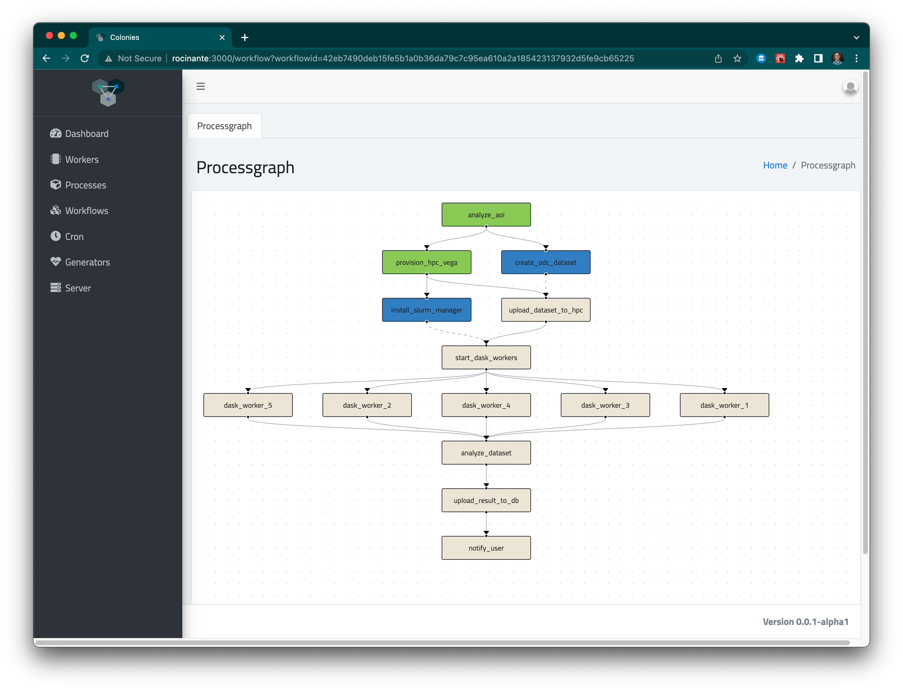
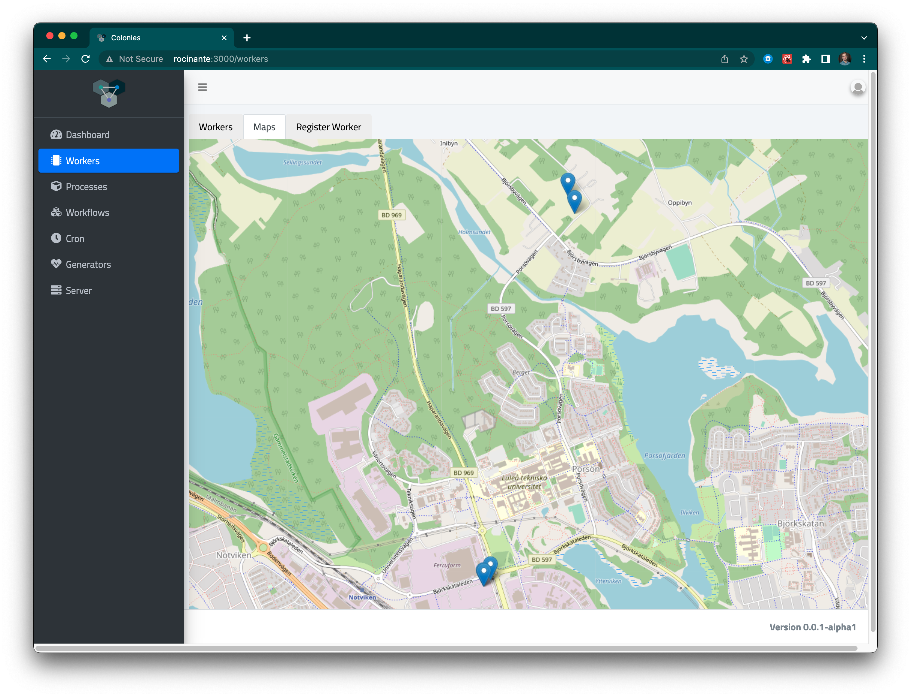

[](https://codecov.io/gh/colonyos/colonies)
[](https://github.com/colonyos/colonies/actions/workflows/go.yml)



# What is Colonies?
Colonies is an open-source framework designed to facilitate seamless execution of computational workloads across platforms, e.g. cloud, edge, devices, or High-Performance Computing (HPC), thereby creating so-called *compute continuums*. 

At its core, Colonies provides a **distributed runtime environment**, called a **Colony**, consisting of a network of loosely connected **Executors**. Executors are distributed microservices that can easily integrate with any third-party application or system. They can be implemented in any language and run anywhere on the Internet, e.g. on supercomputers or in a web browser on a smart phone.

Colonies has been developed with a strong emphasis on security and robustness to ensure scalability and reliability.

## How does it work? 
* Users submit function specifications to a Colonies server specifying computations they wish to run. These functions will then be assigned and executed by the Executors.
* Developers can focus on implementing Executors as independent microservices. The system can then easily scale just by deploying more Executors, enabling parallel execution. Failed processes are automatically re-assigned to other Executors.
* Developers can express and submit workflows describing a sequence of computations carried out by several Executors.
* Colonies makes it possible to develop a loosely decoupled architecture that spans multiple platforms and infrastructures, with all coordination managed by Colonies.
* Colonies also functions as a distributed ledger, containing full execution history. This enables developers to keep track of the system and debug it more easily.
* Colonies integrates well with Kubernetes and offers a more powerful alternative to traditional message-broker worker queues, e.g RabbitMQ.

## Design
* Colonies serves as an intermediary layer to indirectly control and integrate with other computer systems. This enables Executors (or users) to publish instructions and subsequently assign these instructions to other Executors.
* By chaining instructions together, it becomes possible to execute workloads that can operate seamlessly across different platforms
* A build-in **[zero-trust](https://en.wikipedia.org/wiki/Zero_trust_security_model)** protocol makes it possible to organize remote Exectors as a single unit (a Colony). This feature empowers users to maintain control over their workloads, even when distributed across multiple platforms simultaneously.



## Example
### Start a Colonier server
```console
source devenv
colonies dev 
```

### Submit a meta-process
```json
{
    "conditions": {
        "executortype": "cli"
    },
    "funcname": "echo sayhello"
}
```

```console
colonies function submit --spec sayhello.json 
```

### Start a OS executor (executes functions as Unix commands)
```console
colonies executor os start --name testexecutor --executortype cli 

INFO[0000] Lauching process                              Args="[]" Func="echo sayhello"
sayhello
```

See [this guide](docs/Executor.md) how to implement executors in Python, Julia, Go, and JavaScript.

## Dashboard screenshots
Below are some screenshots from the [Colonies Dashboard](https://github.com/colonyos/dashboard):




# More information
## Installation
* [Installation](docs/Installation.md)
## Presentations
* [Process Orchestration with ColonyOS](docs/Colonies.pptx)
## Guides
* [Introduction](docs/Introduction.md)
* [Getting started](docs/GettingStarted.md)
* [How to implement a Colonies executor](docs/Executor.md)
* [How to implement a Fibonacci executor in Go](docs/GoTutorial.md)
* [How to create workflows DAGs](docs/Workflows.md)
* [How to use generators](docs/Generators.md)
* [How to use crons](docs/Crons.md)
* [How to use the Colonies CLI](docs/CLI.md)
## Design
* [Overall design](docs/Design.md)
* [HTTP RPC protocol](docs/RPC.md)
* [Security design](docs/Security.md)
## SDKs
* [Golang Colonies SDK](https://github.com/colonyos/colonies/tree/main/pkg/client)
* [Rust Colonies SDK](https://github.com/colonyos/rust)
* [Julia Colonies SDK](https://github.com/colonyos/Colonies.jl)
* [JavaScript Colonies SDK](https://github.com/colonyos/colonies.js)
* [Python Colonies SDK](https://github.com/colonyos/pycolonies)
* [Haskell Colonies SDK](https://github.com/colonyos/haskell)
## Deployment
* [High-availability deployment](docs/HADeployment.md)
* [Grafana/Prometheus monitoring](docs/Monitoring.md)
* [Kubernetes Helm charts](https://github.com/colonyos/helm)

More information can also be found [here](https://colonyos.io).

# Current users
* Colonies is currently being used by **[RockSigma AB](https://www.rocksigma.com)** to build a compute engine for automatic seismic processing in underground mines. 

# Running the tests
Follow the instructions at [Installation Guide](./docs/Installation.md) then type:
```console
make test
```
