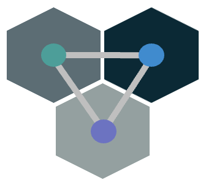

[](https://codecov.io/gh/colonyos/colonies)
[](https://github.com/colonyos/colonies/actions/workflows/go.yml)



# What is Colonies? 
**Colonies** is a generic framework for implementing distributed applications and systems. It can be used as a building block for grid computing or edge computing, e.g. implement a *meta operating system* or *cloud-of-cloud* platform that combines many execution environments. The main use case of Colonies is to orchestrate workloads and establish trusted distributed compute environments across heterogeneous platforms such as multiple Kubernetes clusters, Edge severs or Android devices. 

A Colony is an abstract collection of compute workers operating under a single identity. A crypto-protocol ensure secure and zero-trust process execution by workers connected to arbitrary networks and infrastructures. This enables secure and seamless orchestration of complex machine learning workloads in compute continuums spanning devices, clouds and edge networks over the Internet. The picture below shows an high-level architecture.


More information can also be found [here](https://colonyos.io).

## Key features
* **Batch processing and distributed RPC.** The Colonies Server maintains several prioritized job queues and keeps track of process statuses. Processes not finishing in time are automatically moved back to the job queue to be executed by another worker.  
* **Pull-based orchestration.** Users (or workers) submit process specifications the Colonies Server. Colonies Workers connect to the Colonies Server and request processes to execute. A HTTP Long Polling/WebSocket protocol ensure that workers can reside anywhere on the Internet, even behind firewalls. The Colonies Server never establish connections directly to workers. 
* **Built-in identity and trust management.** A crypto-protocol based on ECDSA (Elliptic Curve Digital Signature Algorithm) offers identity and trust management to enable Colonies Workers member of the same Colony to fully trust each other. Only authorized users or workers can submit process specifications or interact with other workers within a Colony.
* **Decentralization.** A built-in Distributed Hash table (Kademlia) makes it possible to create federations of Colonies Servers to offer self-sovereignty and trust chains. Each Colonies Server can join a global overlay network of connected Colonies Servers on the Internet, similar to technologies like IPFS. 
* **Implemented in Golang** with a standard PostgreSQL backend (backlog).
* **SDK in Python, Julia, and Golang.**

https://argoproj.github.io/argo-workflows/
## Example of use cases
* **Manage ML/AI workloads on Kubernetes.** Launch one or several Colonies Worker containers in a Kubernetes Pod. Then use Colonies to enable batch processing and launch processes inside Worker containers. Launching processes inside already started containers can be significantly more efficient than frameworks like [Argo Workflows](https://argoproj.github.io/argo-workflows) that launches new containers for each new task, especially when dealing with AI workflows consisting of huge containers (tens of gigabytes) or when a huge amount of data needs to be shuffled into memory to perform a certain computation.
* **Grid computing.** Create "non-malicious" botnets and launch processes to perform computations at IoT devices, smart phones or cloud servers; all controlled from the Colonies Server.
* **Manage complex workflows spanning multiple cloud/edge servers and devices**, e.g. setting up multimedia pipelines and ML inference servers running on multiple platforms connected to different networks.

## Getting started example
1. Install Colonies CLI tool.
```console
wget https://github.com/colonyos/colonies/blob/main/bin/colonies?raw=true -O /bin/colonies
chmod +x /bin/colonies
```

2. Start a Colonies development server. The development server is for testing only. All data will be lost when restarting the server. Also note that all keys are well known and all data is sent over unencrypted HTTP.
```console
colonies dev
```

You will have to add some environmental variables in order to use the server.

```console
export COLONIES_SERVER_PROTOCOL="http"
export COLONIES_SERVER_HOST="localhost"
export COLONIES_SERVER_PORT="50080"
export COLONIES_SERVERID="039231c7644e04b6895471dd5335cf332681c54e27f81fac54f9067b3f2c0103"
export COLONIES_SERVERPRVKEY="fcc79953d8a751bf41db661592dc34d30004b1a651ffa0725b03ac227641499d"
export COLONIES_COLONYID="4787a5071856a4acf702b2ffcea422e3237a679c681314113d86139461290cf4"
export COLONIES_COLONYPRVKEY="ba949fa134981372d6da62b6a56f336ab4d843b22c02a4257dcf7d0d73097514"
export COLONIES_RUNTIMEID="3fc05cf3df4b494e95d6a3d297a34f19938f7daa7422ab0d4f794454133341ac"
export COLONIES_RUNTIMEPRVKEY="ddf7f7791208083b6a9ed975a72684f6406a269cfa36f1b1c32045c0a71fff05"
```
or 
```console
source examples/devenv
```

3. Start a Colonies Worker.
Open another terminal (and *source examples/devenv*).

```console
colonies worker start --name myworker --type testworker --insecure
```
4. Submit a process specification to the worker.
Example process specification (examples/sleep.json).  Will cause the Colonies Worker above to sleep for 100s. 
```json
{
  "conditions": {
    "runtimetype": "testworker"
  },
  "cmd": "sleep",
  "args": [
    "100"
  ],
  "env": {
    "TEST": "testenv"
  }
}
```

Open another terminal (and *source examples/devenv*).
```console
$ colonies process submit --spec sleep.json --insecure
```

Check out running processes:
```console
$ colonies process ps --insecure
+------------------------------------------------------------------+-------+------+---------------------+----------------+
|                                ID                                |  CMD  | ARGS |     START TIME      | TARGET RUNTIME |
+------------------------------------------------------------------+-------+------+---------------------+----------------+
| 6681946db095e0dc2e0408b87e119c0d2ae4f691db6899b829161fc97f14a1d0 | sleep | 100  | 2022-04-05 16:40:01 | myworkertype   |
+------------------------------------------------------------------+-------+------+---------------------+----------------+
```

Check out process status: 
```console
$ colonies process get --processid 6681946db095e0dc2e0408b87e119c0d2ae4f691db6899b829161fc97f14a1d0 --insecure
Process:
+-------------------+------------------------------------------------------------------+
| ID                | 6681946db095e0dc2e0408b87e119c0d2ae4f691db6899b829161fc97f14a1d0 |
| IsAssigned        | True                                                             |
| AssignedRuntimeID | 66f55dcb577ca6ed466ad5fcab868673bc1fc7d6ea7db71a0af4fea86035c431 |
| State             | Running                                                          |
| SubmissionTime    | 2022-04-05 16:40:00                                              |
| StartTime         | 2022-04-05 16:40:01                                              |
| EndTime           | 0001-01-01 01:12:12                                              |
| Deadline          | 0001-01-01 01:12:12                                              |
| WaitingTime       | 753.441ms                                                        |
| ProcessingTime    | 1m23.585764152s                                                  |
| Retries           | 0                                                                |
+-------------------+------------------------------------------------------------------+

ProcessSpec:
+-------------+-------+
| Cmd         | sleep |
| Args        | 100   |
| Volumes     | None  |
| MaxExecTime | -1    |
| MaxRetries  | 0     |
+-------------+-------+

Conditions:
+-------------+------------------------------------------------------------------+
| ColonyID    | 4787a5071856a4acf702b2ffcea422e3237a679c681314113d86139461290cf4 |
| RuntimeIDs  | None                                                             |
| RuntimeType | myworkertype                                                     |
| Memory      | 0                                                                |
| CPU Cores   | 0                                                                |
| GPUs        | 0                                                                |
+-------------+------------------------------------------------------------------+

Attributes:
+------------------------------------------------------------------+------+---------+------+
|                                ID                                | KEY  |  VALUE  | TYPE |
+------------------------------------------------------------------+------+---------+------+
| 2fe15f1b570c7328854f2374a69e45845ef5a40624ec06c287a51a5732485ecc | TEST | testenv | Env  |
+------------------------------------------------------------------+------+---------+------+
```

# Links
* [Installation](docs/Installation.md)
* [Using the Colonies CLI tool](docs/CLI.md)
* [Tutorial (implement your own Colonies Worker using the Golang SDK)](docs/Tutorial.md)
* [HTTP RPC Protocol](docs/RPC.md)

# Security principles
A core component of Colonies is a crypto identity protocol inspired by Bitcoin and Ethereum. Each Colony and Colony Runtime is assigned a *Digital Identity* that is verified by the Colonies server using a so-called [Implicit certificates](https://en.wikipedia.org/wiki/Implicit_certificate), which is implemented using [Elliptic-curve cryptography](https://en.wikipedia.org/wiki/Elliptic-curve_cryptography). This protocol makes it possible to reconstruct public-keys from signatures. Identities can then simply be calculated as cryptographic hashes (SHA3-256) of the reconstructed public-keys.

The Colonies Server keeps track of these identities and applies several rules how runtimes are allowed to interact with each other. 

1. Only the Colonies Server Owner can register a new Colony. 
2. Only the Colonies Server Owner can list registered Colonies. 
3. Only a Colony Owner can register a Colony Runtimes to a Colony. 
4. Only a Colony Owner can list/get info about Colony.
5. Only a Colony Owner can approve/disapprove a Runtime.
6. Any Colony Runtime of a Colony can submit/get/list processes. 
7. Only the Colony Runtime that was assigned a process can set attributes on that process. 
8. Any Colony Runtime can get/list attributes on processes. 

Note that the Colonies server does not store any crypto keys, but rather stores identites in a database and verifies that reconstructed identities obtained from RPC calls match the identities stored in the database. This protocol works as follows. Let's assume a Runtime client has the following Id: 

```
69383f17554afbf81594999eec96adbaa0fc6caace5f07990248b14167c41e8f
```

It then sends the following message to the Colonies Server:

```json
{
    "payloadtype": "addcolonymsg",
    "payload": "ewogICAgICBjb2xvbnlpZDogYWM4ZGM4OTQ5YWYzOTVmZDUxZWFkMzFkNTk4YjI1MmJkYTAyZjFmNmVlZDExYWNlN2ZjN2RjOGRkODVhYzMyZSwKICAgICAgbmFtZTogdGVzdF9jb2xvbnlfbmFtZQogIH0=",
    "signature": "82f2ba6368d5c7d0e9bfa6a01a8fa4d4263113f9eedf235e3a4c7b1febcdc2914fe1f8727746b2f501ceec5736457f218fe3b1a469dd6071775c472a802aa81501",
}
```

When the server receives the message, it reconstructs the Id of the calling client using the enclosed signature and payload. This means that client Id (e.g. 82f2ba6368d5c7d0e9bfa6...) is never sent to the server but rather derived by the server from messages it receives. In the example above, the server checks in the database if the reconstructed Id is a server owner.

# Running the Tests
Follow the instructions at [Installation Guide](./docs/Installation.md) and setup a Postgresql server, then type:
```console
make test
```
