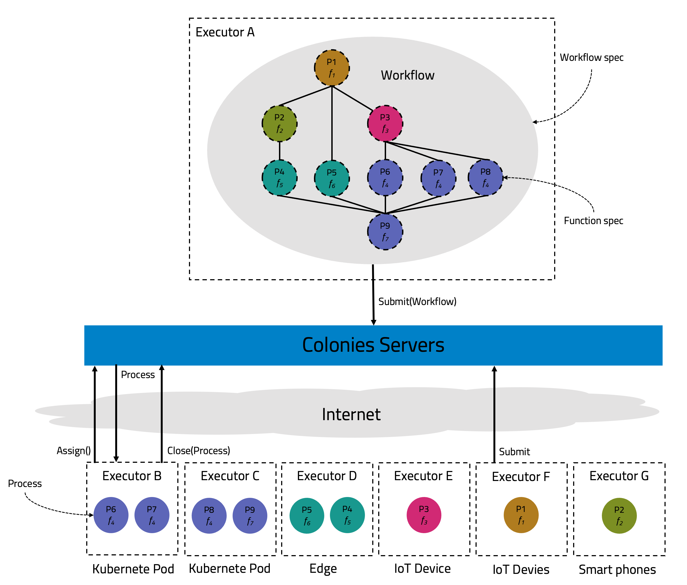
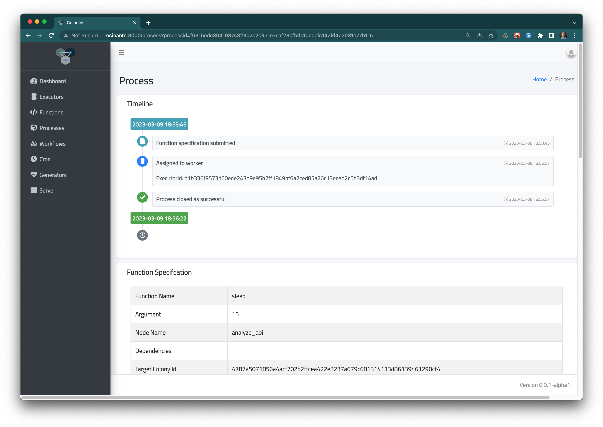

[](https://codecov.io/gh/colonyos/colonies)
[](https://github.com/colonyos/colonies/actions/workflows/go.yml)


# ColonyOS - Distributed Meta-Orchestrator

ColonyOS is an open-source framework for seamless execution of computational workloads across heterogeneous platforms - cloud, edge, HPC, IoT devices, and beyond. It creates **Compute Continuums** by providing a unified orchestration layer that operates as a meta-orchestrator on top of existing infrastructure.

## Why ColonyOS?

Traditional orchestration systems are tied to specific platforms (Kubernetes for cloud, Slurm for HPC, etc.). ColonyOS breaks these silos through **meta-process management** - a broker-based architecture that separates computational intent from execution.

Example of use cases:

- **Scientific Computing**: Process satellite imagery, analyze sensor data, run simulations across HPC clusters
- **AI/ML Pipelines**: Distribute training jobs, run inference on edge devices, orchestrate multi-agent LLM systems
- **Serverless at Scale**: Build FaaS platforms that span cloud, edge, and on-premise infrastructure
- **Data Processing**: ETL pipelines, batch processing, real-time stream processing with ColonyFS integration
- **Industrial IoT**: Coordinate computations across factory floor devices, edge gateways, and cloud
- **Earth Observation**: Automated satellite image processing and analysis workflows
- **Infrastructure as Code**: Declaratively manage infrastructure across computing continuums - define services spanning cloud, edge, HPC, and IoT with GitOps workflows, automatic drift detection, and self-healing reconciliation

### The Core Idea

**Declarative Intent + Broker + Distributed Execution = Computing Continuums**

Instead of writing platform-specific code, you declare **WHAT** you want to compute using Function Specifications. The Colonies Server acts as a **broker** that matches your intent with available **Executors** (distributed workers) that know **HOW** to execute on their specific platforms. This separation creates seamless **Computing Continuums** across heterogeneous infrastructure.

### Key Advantages

- **Platform Agnostic**: Same function specification runs on Kubernetes, HPC, edge devices, IoT - executors translate to platform-specific execution
- **Decoupled Architecture**: Submit work anytime, execute asynchronously - temporal and spatial decoupling via broker
- **Zero-Trust by Design**: No session tokens, no passwords - every request cryptographically signed with Ed25519
- **Protocol Flexibility**: Choose HTTP/REST, gRPC, CoAP (IoT), or LibP2P (P2P) - or run them all simultaneously
- **Pull-Based Execution**: Executors connect from anywhere (even behind NAT/firewalls) and pull work - no need for inbound access
- **Built-in Audit Trail**: Every execution recorded as an immutable ledger for compliance and debugging
- **Real-Time Reactive**: WebSocket subscriptions for instant notifications on workflow state changes

## Key Features

- **Multi-Protocol Architecture**: Native support for HTTP/REST, gRPC, CoAP (IoT), and LibP2P (peer-to-peer)
- **Distributed Execution**: Executors run anywhere on the Internet - supercomputers, edge devices, browsers, embedded systems
- **Zero-Trust Security**: All communication cryptographically signed with Ed25519
- **Workflow DAGs**: Complex computational pipelines with parent-child dependencies
- **Event-Driven**: Real-time WebSocket subscriptions for process state changes
- **Scheduled Execution**: Cron-based and interval-based job scheduling
- **Dynamic Batching**: Generators that pack arguments and trigger workflows based on counter or timeout conditions
- **Service Reconciliation**: Kubernetes-style declarative service management with automatic drift detection and correction
- **Full Audit Trail**: Complete execution history stored as an immutable ledger
- **High Availability**: Etcd-based clustering with automatic failover
- **Multi-Language SDKs**: Go, Rust, Python, Julia, JavaScript, Haskell

## Architecture

### Core Concepts

- **Colony**: A distributed runtime environment - a network of loosely connected Executors
- **Executor**: Distributed worker that pulls and executes workloads (can be implemented in any language, runs anywhere)
- **Process**: Computational workload with states: WAITING → RUNNING → SUCCESS/FAILED
- **FunctionSpec**: Specification defining what computation to run and execution conditions
- **ProcessGraph**: Workflow represented as a Directed Acyclic Graph (DAG)
- **Service**: Declarative infrastructure specification with desired state management
- **Reconciliation**: Automatic drift detection and correction that maintains services in their desired state

### How It Works

1. **Submit**: Users submit function specifications to the Colonies server
2. **Schedule**: The scheduler assigns processes to available Executors based on conditions
3. **Execute**: Executors pull assigned processes, execute them, and report results
4. **Chain**: Complex workflows span multiple platforms by chaining processes together
5. **Monitor**: Real-time subscriptions and full execution history enable observability



### Zero-Trust Security Model

Colonies implements a **zero-trust architecture** where all communication is cryptographically signed:
- No traditional authentication tokens or session management
- Each request signed with Ed25519 private keys
- Server validates signatures and enforces role-based access control
- Executors can operate on untrusted infrastructure while maintaining security

### Multi-Backend Support

Run Colonies server with any combination of protocols:

| Backend | Use Case | Port |
|---------|----------|------|
| **HTTP/REST** | Web APIs, dashboards, traditional clients | 8080 |
| **gRPC** | High-performance, low-latency communication | 50051 |
| **CoAP** | IoT devices, constrained environments | 5683 |
| **LibP2P** | Peer-to-peer, decentralized, NAT traversal | 4001 |

Configure via environment variable:
```bash
export COLONIES_SERVER_BACKENDS="http,grpc,libp2p"  # Run multiple protocols simultaneously
```

## Tutorials

Comprehensive step-by-step tutorials are available in the [tutorials repository](https://github.com/colonyos/tutorials):

## Dashboard

The [Colonies Dashboard](https://github.com/colonyos/dashboard) provides a web UI for monitoring and managing your compute continuum:




## Documentation

### Getting Started
- [Installation Guide](docs/Installation.md) - Install and configure Colonies
- [Getting Started](docs/GettingStarted.md) - Your first Colonies application
- [Configuration](docs/Configuration.md) - Environment variables and settings
- [Backend Configuration](docs/BackendConfigs.md) - HTTP, gRPC, CoAP, LibP2P setup

### Guides
- [Introduction](docs/Introduction.md) - Core concepts and architecture
- [Implementing Executors](docs/Executor.md) - Create executors in Python, Go, Julia, JavaScript
- [Fibonacci Tutorial (Go)](docs/GoTutorial.md) - Complete example application
- [Workflow DAGs](docs/Workflows.md) - Create complex computational pipelines
- [Generators](docs/Generators.md) - Batch processing and dynamic workflows
- [Cron Jobs](docs/Crons.md) - Schedule recurring tasks
- [CLI Usage](docs/CLI.md) - Command-line interface reference
- [Logging](docs/Logging.md) - Process logging and monitoring

### Architecture & Design
- [Overall Design](docs/Design.md) - System architecture and design patterns
- [RPC Protocol](docs/RPC.md) - HTTP RPC protocol specification
- [Security Design](docs/Security.md) - Zero-trust security model

### Deployment
- [Container Building](docs/ContainerBuilding.md) - Build Docker containers for single and multi-platform
- [High-Availability Deployment](docs/HADeployment.md) - Production cluster setup
- [Monitoring](docs/Monitoring.md) - Grafana and Prometheus integration
- [Kubernetes Helm Charts](https://github.com/colonyos/helm) - Deploy on Kubernetes

### SDKs & Tools
- [Go SDK](https://github.com/colonyos/colonies/tree/main/pkg/client) - Official Go client library
- [Python SDK](https://github.com/colonyos/pycolonies) - Python client library
- [Rust SDK](https://github.com/colonyos/rust) - Rust client library
- [Julia SDK](https://github.com/colonyos/Colonies.jl) - Julia client library
- [JavaScript SDK](https://github.com/colonyos/colonies.js) - JavaScript/Node.js library
- [Haskell SDK](https://github.com/colonyos/haskell) - Haskell client library
- [Executors](https://github.com/colonyos/executors) - Pre-built executor implementations

## Development
The repository contains a development container configuration to simplify development environment setup. You can use it locally or in a [GitHub Codespace](https://docs.github.com/en/codespaces).

**Local Development (VS Code):**

1. Install Docker on your machine.
2. Install the Dev Containers extension in Visual Studio Code.
3. Clone this repository.
4. Open the folder in Visual Studio Code.
5. When prompted, select "Reopen in Container" or use the command "Dev Containers: Open Folder In Container..." from the command palette.

**GitHub Codespaces:**

- Simply create a Codespace from the repository page on GitHub. The development container will be set up automatically.

### Building

```bash
make build              # Build the main colonies binary
make container          # Build Docker container for local architecture
make container-multiplatform  # Build for amd64 and arm64
make install            # Install to /usr/local/bin
```

For detailed instructions on building containers including multi-platform builds, see the [Container Building Guide](docs/ContainerBuilding.md).

### Testing

```bash
make test              # Run all tests
make github_test       # Run tests for CI (no color output)

# Test specific backends
COLONIES_BACKEND_TYPE=gin make test
COLONIES_BACKEND_TYPE=grpc make test
COLONIES_BACKEND_TYPE=libp2p make test
```

### Code Coverage

```bash
make coverage         # Generate coverage reports
```

## Production Usage

ColonyOS is currently used in production by:

- **[RockSigma AB](https://www.rocksigma.com)** - Automatic seismic processing engine for underground mines, orchestrating workloads across cloud and edge infrastructure

## Contributing

Contributions are welcome! Please see our contributing guidelines and code of conduct.

## Community

- Website: [colonyos.io](https://colonyos.io)
- GitHub: [github.com/colonyos](https://github.com/colonyos)
- Tutorials: [github.com/colonyos/tutorials](https://github.com/colonyos/tutorials)

## License

See LICENSE file for details.
