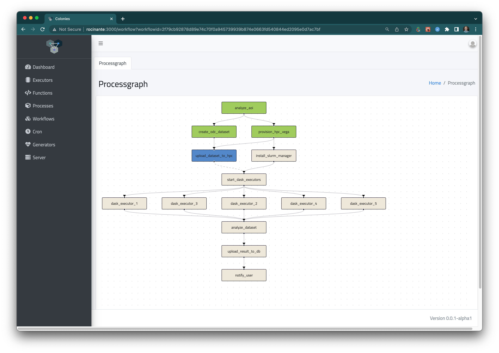

[](https://codecov.io/gh/colonyos/colonies)
[](https://github.com/colonyos/colonies/actions/workflows/go.yml)


# What is Colonies?
Colonies is a **distributed serverless FaaS framework** for process orchestration and managing AI/ML workloads across heterogeneous computing platforms such public clouds, edge servers as well as web apps or IoT devices.

## Key features
* Users submit specifications of functions (or workflows) to the Colonies server they want to run. These functions will then be executed by **Executors**, which are computer programs residing anywhere on the Internet.
* Colonies makes it possible to implement a **loosely decoupled** workflow architecture spanning many platforms and infrastructures. All coordination is managed by Colonies servers and developers can focus on implementing **Executors** based on a **Function-as-a-Service (FaaS)** event-driven execution model. 
* Complex workflows are automatically broken down into events (process assignments) that is received by the Executors. The system can then easily scale just by deploying more Executors. Failed processes are automatically re-assigned to other Executors. 
* Colonies function a **distributed ledger** and contains full execution history. Traceability allows developers to keep track of the system and more easily debug their services.  
* Colonies integrates well with Kubernetes and offers a more powerful alternative than traditional message-broker worker queues, e.g RabbitMQ worker queues.   
* Colonies provides functionality to establish **trusted distributed computing environments** and is a building block for a [Meta-Operating System](https://en.wikipedia.org/wiki/Meta-system"), an overlay built on top of existing operating systems and platforms to create *compute continuums spanning devices, webapps, clouds, and edge and HPC platforms*.

## Design
The core idea of Colonies is to split up complex workloads in two layers, a **Meta-layer** and an **Execution-layer**.


* The **Meta-layer** makes it possible to describe and manage complex workflows independently of implementation and execution environment.
* The **Execution-layer** provides a [serverless computing](https://en.wikipedia.org/wiki/Serverless_computing) environment where developers can implement Executors implementing different functions. AI applications can then be broken down into composable functions executed by remote Executors anywhere on the Internet.
* A build-in **[zero-trust](https://en.wikipedia.org/wiki/Zero_trust_security_model)** protocol makes it possible to organize remote Exectors as a single unit called a **Colony**, thus making it possible for users to keep control even if workloads are spread out and executed on many different platforms at the same time. 

## Example
### Start a Colonier server
```console
source devenv
colonies dev 
```

### Submit a meta-process
```json
{
    "conditions": {
        "executortype": "cli"
    },
    "func": "echo sayhello"
}
```

```console
colonies process submit --spec sayhello.json 
```

### Start a Unix worker (executes functions as Unix commands)
```console
colonies worker start --name testworker --executortype cli 

INFO[0000] Lauching process                              Args="[]" Func="echo sayhello"
sayhello
```

See [this guide](docs/Worker.md) how to implement workers in Python, Julia, Go, and JavaScript.

## Dashboard screenshots
Below are some screenshots from the [Colonies Dashboard](https://github.com/colonyos/dashboard):




# More information
## Installation
* [Installation](docs/Installation.md)
## Presentations
* [Process Orchestration with ColonyOS](docs/Colonies.pptx)
## Guides
* [Introduction](docs/Introduction.md)
* [Getting started](docs/GettingStarted.md)
* [How to implement a Colonies executor](docs/Worker.md)
* [How to implement a Fibonacci executor in Go](docs/GoTutorial.md)
* [How to create workflows DAGs](docs/Workflows.md)
* [How to use generators](docs/Generators.md)
* [How to use crons](docs/Crons.md)
* [How to use the Colonies CLI](docs/CLI.md)
## Design
* [Overall design](docs/Design.md)
* [HTTP RPC protocol](docs/RPC.md)
* [Security design](docs/Security.md)
## SDKs
* [Golang Colonies SDK](https://github.com/colonyos/colonies/tree/main/pkg/client)
* [Rust Colonies SDK](https://github.com/colonyos/rust)
* [Julia Colonies SDK](https://github.com/colonyos/Colonies.jl)
* [JavaScript Colonies SDK](https://github.com/colonyos/colonies.js)
* [Python Colonies SDK](https://github.com/colonyos/pycolonies)
* [Haskell Colonies SDK](https://github.com/colonyos/haskell)
## Deployment
* [High-availability deployment](docs/HADeployment.md)
* [Grafana/Prometheus monitoring](docs/Monitoring.md)
* [Kubernetes Helm charts](https://github.com/colonyos/helm)

More information can also be found [here](https://colonyos.io).

# Current users
* Colonies is currently being used by **[RockSigma AB](https://www.rocksigma.com)** to build a compute engine for automatic seismic processing in underground mines. 

# Running the tests
Follow the instructions at [Installation Guide](./docs/Installation.md) then type:
```console
make test
```
