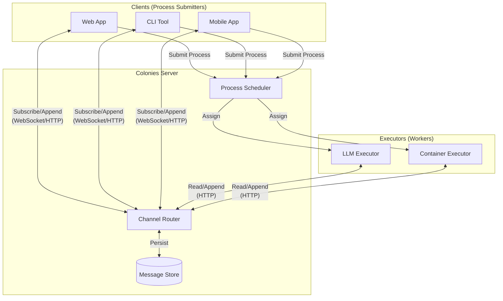
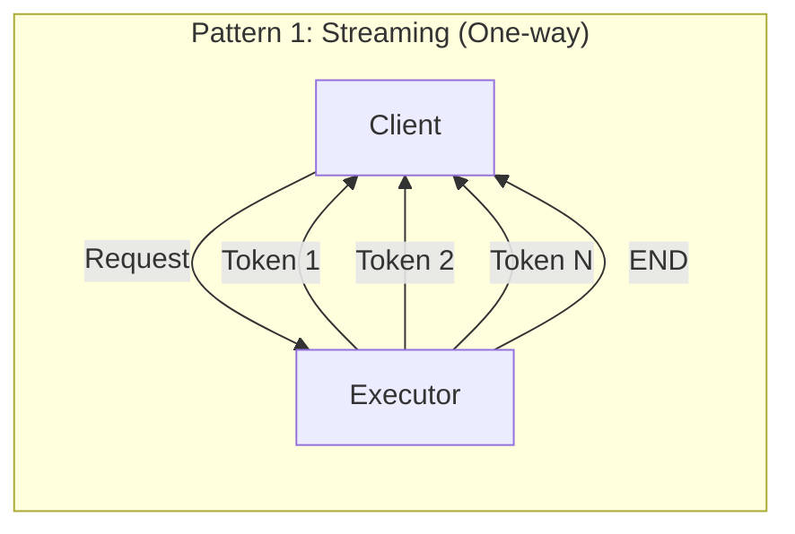
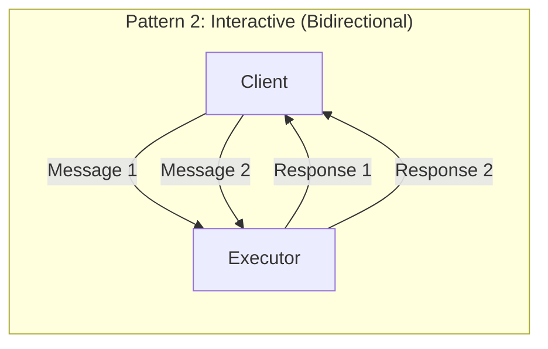
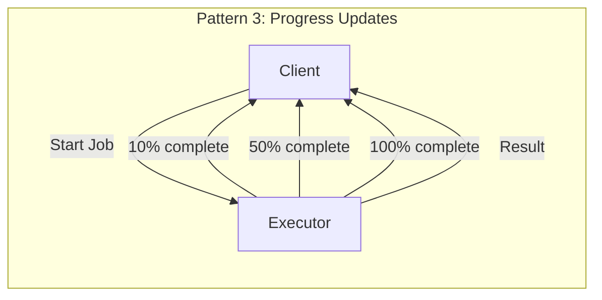
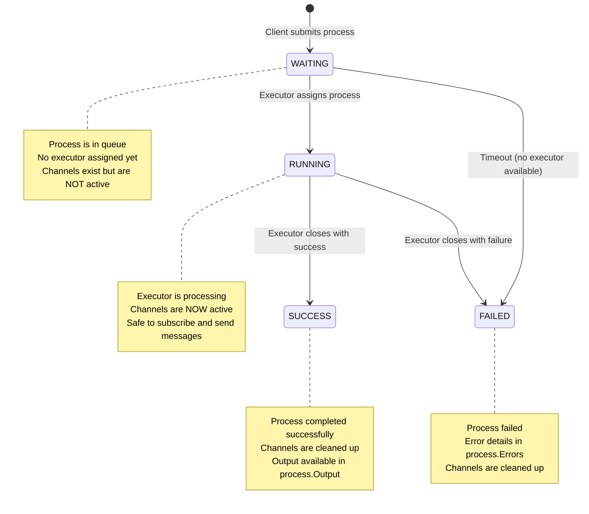
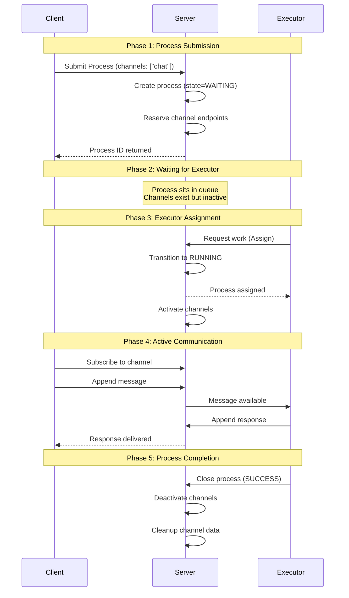
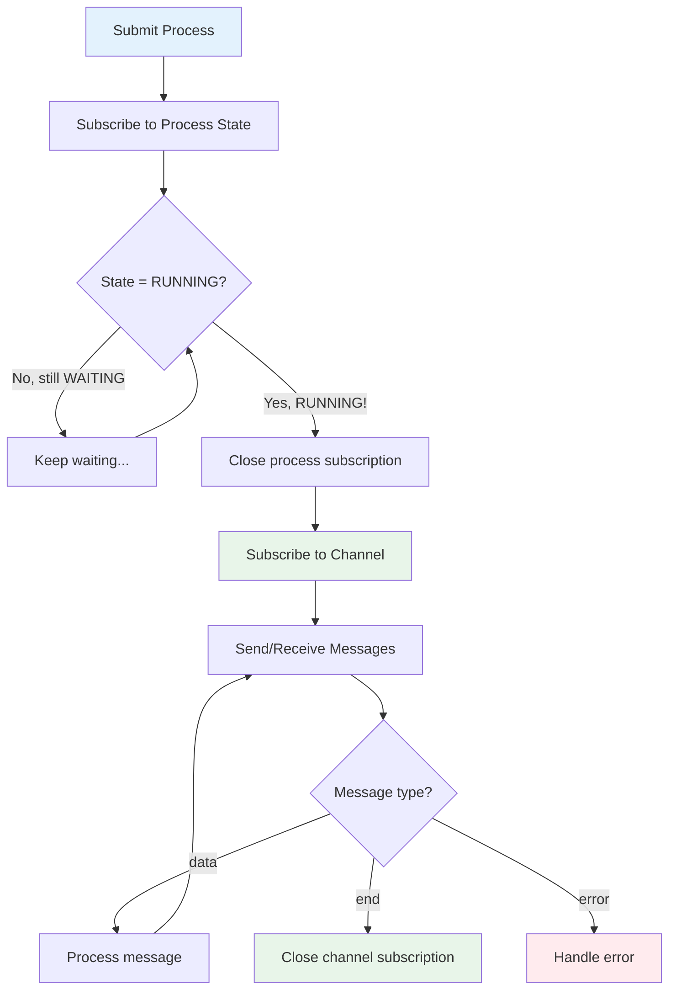
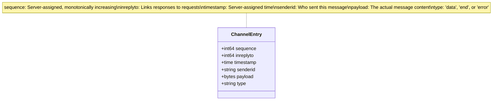
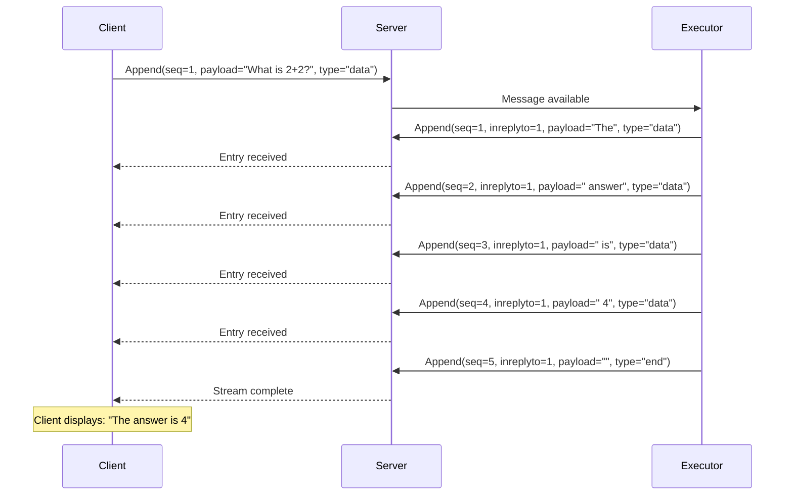
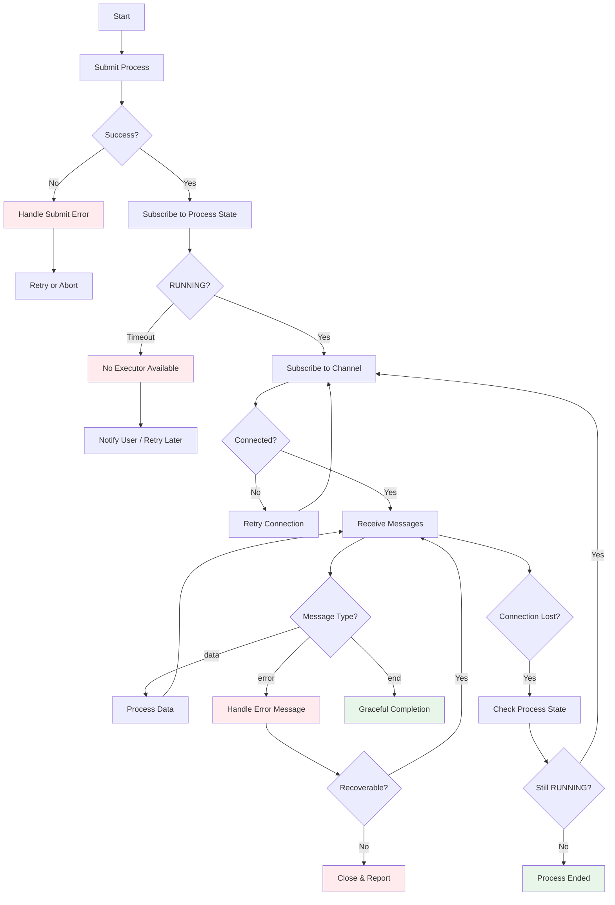

# Channels Tutorial

Channels provide bidirectional, real-time communication between clients and executors in ColonyOS. They enable streaming responses, interactive conversations, and event-driven workflows.

## Table of Contents

1. [Overview](#overview)
2. [Architecture](#architecture)
3. [Process Lifecycle and Channels](#process-lifecycle-and-channels)
4. [The Critical Pattern: Wait for RUNNING](#the-critical-pattern-wait-for-running)
5. [Message Structure](#message-structure)
6. [Step-by-Step Implementation](#step-by-step-implementation)
7. [Complete Examples](#complete-examples)
8. [Error Handling](#error-handling)
9. [Best Practices](#best-practices)
10. [API Reference](#api-reference)

---

## Overview

A channel is an append-only message log associated with a process. Think of it as a persistent, ordered stream of messages that both the client (the entity that submitted the process) and the executor (the worker processing it) can read from and write to. Unlike traditional HTTP request-response patterns where you send a request and wait for a complete response, channels allow for continuous, incremental communication throughout the entire lifetime of a process.

Each channel is identified by a name (like "chat" or "progress") and belongs to exactly one process. When that process ends, either through successful completion or failure, the channel is automatically cleaned up. This tight coupling between channels and processes ensures that resources are properly managed and that there are no orphaned communication streams left behind.

### Why Channels?

In distributed computing, there is often a fundamental mismatch between how work is performed and how results are delivered. Consider a large language model generating a response: the model produces tokens one at a time over several seconds, but a traditional HTTP request would force the client to wait until all tokens are generated before seeing any output. This creates a poor user experience and wastes the opportunity for real-time feedback.

Traditional request-response patterns fail in several important scenarios. Long-running computations present the first challenge. When a process takes minutes or even hours to complete, users need visibility into what is happening. Without channels, the only options are to either wait blindly for the final result or implement complex polling mechanisms that add latency and server load. Channels provide a natural way to stream progress updates as they happen.

Streaming data presents another challenge that channels address elegantly. Large Language Models and other generative AI systems produce output incrementally. By streaming tokens through a channel as they are generated, users can see responses forming in real-time, dramatically improving perceived responsiveness. This is the same pattern used by ChatGPT and other modern AI interfaces.

Interactive sessions require true bidirectional communication. A chat application is not simply a series of independent requests and responses. Rather, it is an ongoing conversation where context matters and either party may need to send messages at any time. Channels provide this bidirectional capability while maintaining message ordering and persistence.

Event-driven workflows round out the use cases where channels shine. Sometimes an executor needs to notify a client about something unexpected, perhaps a warning about resource usage, a request for additional input, or a notification that external conditions have changed. Channels allow executors to push information to clients proactively, rather than waiting for the client to poll.

Channels solve these problems by providing a persistent, bidirectional communication layer that exists for the lifetime of a process. Messages are stored in order, can be read by multiple subscribers, and survive temporary network disconnections. This combination of features makes channels the foundation for building responsive, interactive applications on ColonyOS.

### Use Cases

| Use Case | Description |
|----------|-------------|
| **LLM Streaming** | Stream tokens as they're generated, providing real-time feedback |
| **Interactive Chat** | Build conversational AI with back-and-forth messaging |
| **Progress Updates** | Report completion percentage, current step, or status messages |
| **File Processing** | Stream results as files are processed (e.g., image recognition results) |
| **Debugging** | Stream debug logs from executor to client in real-time |
| **Collaborative Workflows** | Multiple clients observing the same process execution |

---

## Architecture

The channel system is built directly into the Colonies server, making it a first-class citizen of the platform rather than an add-on service. This deep integration means that channels automatically benefit from the same security model, scaling properties, and operational tooling as the rest of ColonyOS.

At its core, the channel system implements a publish-subscribe pattern, but with important modifications that make it suitable for process-oriented workflows. Unlike a general-purpose pub/sub system where topics can be created and destroyed independently, channels are always scoped to a specific process. This scoping provides natural resource management and ensures that channel access is governed by the same cryptographic identity system that secures all ColonyOS operations.

The architecture consists of three main components working together: the Channel Router handles subscription management and message delivery, the Message Store provides durable persistence for all channel messages, and the Process Scheduler coordinates the lifecycle events that activate and deactivate channels. When a client or executor sends a message, it flows through the Channel Router, is persisted to the Message Store, and is then delivered to all active subscribers. This design ensures that messages are never lost, even if a subscriber temporarily disconnects.



### How It Works

The lifecycle of a channel is intimately tied to the lifecycle of its parent process, and understanding this relationship is essential for building reliable applications.

Everything begins with process submission. When a client submits a process to ColonyOS, the function specification includes a list of channel names that the process will use. These names are simple strings like "chat", "progress", or "debug". The client chooses these names based on the communication patterns the application requires. A simple streaming application might need only one channel, while a complex interactive application might define several channels for different purposes.

Upon receiving the process submission, the server creates channel endpoints for each declared channel name. At this point, the channels exist in a reserved state. They have been allocated and are associated with the process, but they are not yet fully active. This distinction is crucial and is the source of many bugs when developers attempt to use channels before they are ready.

The process then enters the queue, waiting for an available executor to pick it up. Depending on executor availability, this waiting period might be instantaneous or might take several minutes. During this time, the process remains in the WAITING state, and the channels remain in their reserved but inactive state.

When an executor assigns itself to the process, several things happen in quick succession. The process transitions from WAITING to RUNNING state, and the channels become fully activated. At this moment, and only at this moment, is it safe for clients to subscribe to channels and begin sending messages. The executor, now in control of the process, can also begin using the channels to communicate back to the client.

As messages are sent through channels, each one is persisted to the Message Store with a server-assigned sequence number. These sequence numbers are monotonically increasing and provide a total ordering of all messages within a channel. Subscribers can use these sequence numbers to track their position in the message stream and to resume reading after a disconnection without missing any messages.

Real-time delivery is handled through WebSocket connections. When a subscriber connects to a channel, they receive all new messages as they are appended, typically with latency measured in milliseconds. For clients that cannot use WebSockets, a polling API is also available, though it necessarily has higher latency.

Finally, when the process completes, whether through success or failure, the channels are cleaned up. All pending subscriptions are closed, and depending on the server configuration, the message history may be retained for a period or deleted immediately. This automatic cleanup ensures that resources are not leaked, even if clients disconnect unexpectedly.

### Communication Patterns

Channels support several distinct communication patterns, each suited to different application requirements. Understanding these patterns helps you choose the right approach for your use case and implement it correctly.

The streaming pattern is the simplest and most common. In this pattern, the client sends an initial request, and the executor responds with a stream of messages. This is the natural fit for LLM text generation, where the model produces tokens incrementally. The client receives each token as it is generated, displaying them to the user in real-time. When the executor has finished generating output, it sends a special end-of-stream marker to signal completion. This pattern is essentially unidirectional once the initial request is made, with all subsequent traffic flowing from executor to client.



The interactive pattern extends streaming to support true bidirectional communication. Here, both client and executor can send messages at any time, creating a conversational flow. This pattern is essential for chat applications where users can send follow-up questions, provide clarification, or interrupt a long-running operation. The technical implementation is similar to streaming, but both parties must be prepared to receive messages at any time, not just in response to their own sends. This requires more careful state management on both sides.



The progress updates pattern is designed for long-running operations where the user needs visibility into what is happening. Unlike streaming, where messages represent output data, progress updates are metadata about the operation itself. A file processing job might report percentage complete, current file name, and estimated time remaining. A machine learning training run might report loss values and accuracy metrics. The client typically displays these updates in a progress bar or status panel, giving users confidence that their job is proceeding and an estimate of when it will complete.



These patterns can be combined in a single application. A complex process might use one channel for streaming output, a second channel for progress updates, and a third channel for debug logs. Each channel operates independently, allowing clients to subscribe to only the information they need. A command-line tool might subscribe to all three channels, while a web UI might only subscribe to the output and progress channels, ignoring debug information.

---

## Process Lifecycle and Channels

Understanding the process lifecycle is absolutely critical for reliable channel communication. In fact, failures to properly handle the process lifecycle are the single most common source of bugs when working with channels. Developers who come from traditional request-response programming often assume that they can start using channels immediately after submitting a process. This assumption leads to race conditions, missed messages, and mysterious failures that are difficult to debug.

The core insight is that a process goes through distinct phases, and channels are only usable during one of those phases. Attempting to use channels during the wrong phase will either fail outright or produce subtle bugs that manifest only under certain timing conditions.

### Process States

Every process in ColonyOS goes through a defined lifecycle with four possible states. Understanding these states and the transitions between them is fundamental to working with channels correctly.



### State Values

The process states are represented as integer values in the API. When you subscribe to process state changes or check a process's current state, you will work with these numeric values. It is helpful to define constants in your code to make state checks more readable.

| State | Integer Value | Description |
|-------|---------------|-------------|
| `WAITING` | 0 | Process submitted, sitting in queue, waiting for an executor |
| `RUNNING` | 1 | Executor has picked up the process and is actively working on it |
| `SUCCESS` | 2 | Process completed successfully |
| `FAILED` | 3 | Process failed (timeout, error, or executor failure) |

The WAITING state is where every process begins its life. When you call the submit API, your process is placed in a queue and assigned this state. The process will remain in WAITING until an executor that matches the process's conditions becomes available and claims it. If your colony has dedicated executors running, this transition typically happens within milliseconds. However, if executors are busy or unavailable, the process might wait for an extended period or eventually time out.

The RUNNING state indicates that an executor has taken ownership of the process and is actively working on it. This is the only state during which channels are fully functional. The moment a process transitions to RUNNING, its channels become active, and both the client and executor can begin exchanging messages. The process will remain in RUNNING until the executor explicitly closes it or until the maximum execution time expires.

The SUCCESS state indicates normal completion. The executor has finished its work, called the close API with a success indication, and potentially stored results in the process output field. Once a process reaches SUCCESS, its channels are deactivated and eventually cleaned up. You cannot send or receive channel messages for a process in this state.

The FAILED state indicates that something went wrong. This might be because the executor encountered an error and reported it, because the process exceeded its maximum execution time, or because the executor crashed or disconnected before completing the work. Like SUCCESS, the FAILED state means channels are no longer available. Error details are typically stored in the process's errors field.

### The Channel Lifecycle

Channels have their own lifecycle that is tightly coupled to the process lifecycle. Understanding this coupling is essential for avoiding timing-related bugs.

When a process is created, the server reserves the channel names specified in the function specification. At this point, the channels exist in a conceptual sense, they have been allocated and associated with the process, but they are not yet ready for use. Think of this as a reservation rather than an activation.

The channels become fully active only when the process transitions to the RUNNING state. This activation is atomic with the state transition, meaning there is no window where the process is RUNNING but the channels are not yet ready. Once RUNNING, both the client who submitted the process and the executor who is processing it can subscribe to channels, append messages, and read the message history.

When the process completes (either SUCCESS or FAILED), the channels are deactivated. Active subscriptions receive a close notification, and any subsequent attempts to use the channels will fail. The message history may be retained briefly for debugging purposes, but eventually it is cleaned up to free resources.

The following sequence diagram illustrates these lifecycle phases in detail:



---

## The Critical Pattern: Wait for RUNNING

This section covers the single most important concept when working with channels. If you take away only one thing from this entire tutorial, it should be this: you must wait for the process to reach the RUNNING state before subscribing to or writing to channels. Violating this rule will cause your application to fail in ways that are often intermittent and difficult to debug.

### Why This Matters

To understand why this pattern is so critical, consider what happens when you submit a process. The server receives your request and creates a new process record with an initial state of WAITING. At the same moment, the server reserves the channel names you specified in your function specification, but crucially, it does not fully activate them yet. The process is then placed in a queue, waiting for an executor that matches its conditions to become available and claim it.

At this point, the process exists, and you have its ID, but the channels are not ready for use. If you try to subscribe to a channel immediately after submitting, several bad things can happen.

You might get a "Channel not found" error if the channel system has not yet fully initialized the reserved channels. This is the best-case scenario because at least the error is obvious and immediate.

More insidiously, you might miss messages that the executor sends early. If an executor picks up the process and immediately starts sending messages, and your subscription starts a few milliseconds later, those early messages might be lost. This is a race condition that manifests only when the timing is just right, making it extremely difficult to reproduce and debug.

You might also experience race conditions where your messages arrive before the executor is ready to receive them. If you send a message to the channel before the executor has subscribed, the executor might never see that message. Again, this depends on timing and might work fine in development where everything is fast and local, only to fail in production where network latency introduces delays.

The solution to all these problems is simple: wait for the process to reach the RUNNING state before doing anything with channels. This guarantees that an executor has claimed the process, the channels are fully active, and both parties are ready to communicate.

### The Wrong Way (Don't Do This)

```go
// BAD: Don't do this!
process, _ := colonies.Submit(funcSpec, prvKey)

// Immediately trying to use channels - WRONG!
colonies.ChannelAppend(process.ID, "chat", 1, 0, []byte("Hello"), prvKey)
// This might fail or cause race conditions!
```

```typescript
// BAD: Don't do this!
const process = await client.submitProcess(funcSpec);

// Immediately trying to subscribe - WRONG!
client.subscribeChannelWS(process.processid, "chat", ...);
// This might fail or miss messages!
```

### The Right Way (Always Do This)



### Go Implementation

```go
package main

import (
    "fmt"
    "log"

    "github.com/colonyos/colonies/pkg/client"
    "github.com/colonyos/colonies/pkg/core"
)

func main() {
    // Step 1: Create client and submit process
    colonies := client.CreateColoniesClient("localhost", 4000, true, true)
    prvKey := "your-private-key"
    colonyName := "dev"

    funcSpec := core.CreateEmptyFunctionSpec()
    funcSpec.FuncName = "chat"
    funcSpec.Conditions.ColonyName = colonyName
    funcSpec.Conditions.ExecutorType = "llm-executor"
    funcSpec.Channels = []string{"chat"}

    process, err := colonies.Submit(funcSpec, prvKey)
    if err != nil {
        log.Fatal("Failed to submit process:", err)
    }
    fmt.Printf("Process submitted: %s (state: WAITING)\n", process.ID)

    // Step 2: Subscribe to process state changes
    // This blocks until the process reaches RUNNING state or times out
    fmt.Println("Waiting for executor to pick up the process...")

    runningProcess, err := colonies.SubscribeProcess(
        colonyName,
        process.ID,
        core.RUNNING,  // Target state we're waiting for
        300,           // Timeout in seconds (5 minutes)
        prvKey,
    )
    if err != nil {
        log.Fatal("Timeout or error waiting for executor:", err)
    }

    // Step 3: Process is now RUNNING - channels are active!
    fmt.Printf("Process is RUNNING!\n")
    fmt.Printf("  Assigned Executor: %s\n", runningProcess.AssignedExecutorID)
    fmt.Printf("  Started At: %s\n", runningProcess.StartTime)

    // Step 4: Now it's safe to use channels
    err = colonies.ChannelAppend(process.ID, "chat", 1, 0, []byte("Hello!"), prvKey)
    if err != nil {
        log.Fatal("Failed to send message:", err)
    }
    fmt.Println("Message sent successfully!")

    // Step 5: Read responses
    for {
        entries, err := colonies.ChannelRead(process.ID, "chat", 0, 100, prvKey)
        if err != nil {
            log.Fatal("Failed to read channel:", err)
        }

        for _, entry := range entries {
            // Check for end-of-stream
            if entry.Type == "end" {
                fmt.Println("Stream complete!")
                return
            }

            // Skip our own messages
            if entry.SenderID != runningProcess.AssignedExecutorID {
                continue
            }

            fmt.Printf("Received: %s\n", string(entry.Payload))
        }
    }
}
```

### JavaScript/TypeScript Implementation

```typescript
import { ColonyClient, ColonyEndpoint } from './colony';
import Crypto from './crypto';

async function main() {
    // Step 1: Create client and submit process
    const endpoint = new ColonyEndpoint("localhost", "4000");
    const crypto = new Crypto();
    const client = new ColonyClient(endpoint, crypto, true); // true = TLS
    client.setPrivateKey("your-private-key", 'user');

    const colonyName = "dev";

    const funcSpec = {
        funcname: "chat",
        conditions: {
            colonyname: colonyName,
            executortype: "llm-executor"
        },
        channels: ["chat"]
    };

    const process = await client.submitProcess(funcSpec);
    console.log(`Process submitted: ${process.processid} (state: WAITING)`);

    // Step 2: Subscribe to process state changes via WebSocket
    console.log("Waiting for executor to pick up the process...");

    // We use a Promise to convert the callback-based API to async/await
    const runningProcess = await new Promise<any>((resolve, reject) => {
        const timeoutId = setTimeout(() => {
            reject(new Error("Timeout waiting for executor"));
        }, 300000); // 5 minute timeout

        const processWs = client.subscribeProcessWS(
            colonyName,
            process.processid,
            1,    // RUNNING state = 1
            300,  // Server-side timeout in seconds
            (proc) => {
                // Process reached RUNNING state!
                clearTimeout(timeoutId);
                processWs.close(); // Close this subscription
                resolve(proc);
            },
            (error) => {
                clearTimeout(timeoutId);
                reject(error);
            },
            () => {
                // Connection closed
            }
        );
    });

    // Step 3: Process is now RUNNING - channels are active!
    console.log("Process is RUNNING!");
    console.log(`  Assigned Executor: ${runningProcess.assignedexecutorid}`);
    console.log(`  Started At: ${runningProcess.starttime}`);

    // Step 4: Now subscribe to the channel
    const channelWs = client.subscribeChannelWS(
        process.processid,
        "chat",
        0,     // Start from sequence 0 (beginning)
        300,   // Timeout
        (entries) => {
            for (const entry of entries) {
                // Check for end-of-stream
                if (entry.type === "end") {
                    console.log("Stream complete!");
                    channelWs.close();
                    return;
                }

                // Check for errors
                if (entry.type === "error") {
                    console.error("Error:", entry.payload);
                    channelWs.close();
                    return;
                }

                // Skip our own messages
                if (entry.senderid !== runningProcess.assignedexecutorid) {
                    continue;
                }

                console.log(`Received: ${entry.payload}`);
            }
        },
        (error) => {
            console.error("Channel error:", error);
        },
        () => {
            console.log("Channel connection closed");
        }
    );

    // Step 5: Send a message
    await client.channelAppend(process.processid, "chat", 1, 0, "Hello!");
    console.log("Message sent successfully!");
}

main().catch(console.error);
```

---

## Message Structure

Communication through channels happens via discrete messages, each of which is called an "entry" in the ColonyOS API. Understanding the structure of these entries is important for building robust applications that can properly handle all the information channels provide.

Each entry is more than just a payload. It carries metadata that enables important features like message ordering, request-response correlation, sender identification, and stream control. By leveraging this metadata, you can build sophisticated communication patterns on top of the simple append-and-read primitives that channels provide.

Each message in a channel is called an "entry" and contains several fields:



### Field Descriptions

Each field in a channel entry serves a specific purpose in enabling reliable, ordered communication.

| Field | Type | Description |
|-------|------|-------------|
| `sequence` | int64 | A unique, monotonically increasing number assigned by the server. Use this to track which messages you've read. |
| `inreplyto` | int64 | Optional. Set this to the sequence number of a message you're responding to. Useful for correlating request-response pairs. |
| `timestamp` | time | Server-assigned timestamp when the message was received. |
| `senderid` | string | The ID of the entity that sent this message. This will be either the submitter's ID or the executor's ID. |
| `payload` | []byte | The actual message content. Can be any binary data, but typically UTF-8 text or JSON. |
| `type` | string | Message type: `"data"` (default), `"end"` (stream complete), or `"error"` (error occurred). |

The sequence number deserves special attention because it is fundamental to reliable channel communication. The server assigns this number when it receives a message, and it guarantees that no two messages in the same channel will have the same sequence number. More importantly, sequence numbers always increase, so if message A has a lower sequence number than message B, you know that A was received by the server before B. This ordering guarantee lets you track your reading position and resume after disconnections without missing or duplicating messages.

The inreplyto field enables request-response correlation in bidirectional conversations. When an executor responds to a client's message, it can set inreplyto to the sequence number of the original message. This creates a link between the request and response, which is useful when multiple conversations are interleaved on the same channel. For simple streaming scenarios where messages flow in only one direction, this field is typically left at zero.

The senderid field tells you who sent each message. In a two-party conversation between a client and an executor, this lets you distinguish between messages you sent and messages from the other party. This is important because you typically want to display or process incoming messages differently from outgoing ones. The ID is the cryptographic identity of the sender, derived from their private key.

The payload field contains the actual data being communicated. While it accepts any binary data, in practice most applications use either UTF-8 encoded text or JSON objects. For LLM streaming, the payload is typically a small text fragment representing one or a few tokens. For structured data like progress updates, JSON encoding is more common.

### Message Types

The type field enables stream control, allowing senders to signal important events beyond just data delivery. Without explicit signaling, a receiver would have no way to know when a stream has ended normally versus when the connection was simply lost.

| Type | Purpose | When to Use |
|------|---------|-------------|
| `data` | Regular data message | Default for all normal messages |
| `end` | End-of-stream marker | Executor sends this when it's done streaming |
| `error` | Error notification | Executor sends this when an error occurs |

The data type is used for normal messages and is the default if no type is specified. Every token streamed from an LLM, every progress update, and every chat message uses this type. It simply means "here is some data for you to process."

The end type signals that a stream has completed successfully. When an executor finishes generating output, it sends a message with type "end" to tell the client that no more messages will follow. The payload of an end message is typically empty, though it can contain final summary information if needed. Receiving an end message is the client's cue to close its subscription and finalize any pending operations.

The error type signals that something went wrong during processing. Rather than silently failing or closing the connection, an executor can send an error message with details about what happened. This gives clients the opportunity to display an appropriate error message to users or attempt recovery. After sending an error message, the executor typically closes the process with a failed status.

### Example: Message Flow in an LLM Chat



---

## Step-by-Step Implementation

Now that you understand the concepts behind channels, let's walk through building a complete chat application step by step. This section provides detailed code examples for each phase of channel communication, with thorough explanations of what each piece of code does and why.

The application we'll build is a simple but complete chat client that connects to an LLM executor. It demonstrates all the key patterns: declaring channels, waiting for RUNNING state, subscribing to receive messages, sending messages, and handling stream completion. While the examples show a chat use case, the same patterns apply to any channel-based application.

Both Go and JavaScript/TypeScript examples are provided for each step. The Go examples are suitable for command-line tools and backend services, while the JavaScript/TypeScript examples are designed for web applications and Node.js services.

### Step 1: Define Channels in FunctionSpec

The first step in any channel-based application is declaring the channels you need in your function specification. This declaration happens before process submission and tells the server which channels to allocate for your process. Channel names are simple strings that you choose based on your application's needs.

Channels must be declared upfront when submitting a process. You cannot add channels after submission because the server allocates channel resources at process creation time. Plan your communication needs carefully and declare all channels you might need. Having unused channels costs very little, but trying to use an undeclared channel will fail.

For most applications, a single channel is sufficient. However, you might want multiple channels if you have logically distinct communication streams. For example, a machine learning training job might use one channel for streaming loss metrics and another for debug logs, allowing clients to subscribe to only the streams they care about.

#### Go

```go
import "github.com/colonyos/colonies/pkg/core"

// Create a function specification
funcSpec := core.CreateEmptyFunctionSpec()

// Basic configuration
funcSpec.NodeName = "my-chat-node"        // Optional node name
funcSpec.FuncName = "chat"                 // Function to execute
funcSpec.MaxExecTime = 300                 // Max execution time in seconds
funcSpec.MaxRetries = 0                    // Don't retry on failure

// Conditions for executor matching
funcSpec.Conditions.ColonyName = "dev"
funcSpec.Conditions.ExecutorType = "llm-executor"

// Declare channels - this is the key part!
// You can have multiple channels for different purposes
funcSpec.Channels = []string{
    "chat",      // Main chat channel
    "progress",  // Optional: progress updates
    "debug",     // Optional: debug information
}

// Optional: pass arguments to the executor
funcSpec.Args = []string{"gpt-4", "You are a helpful assistant"}
```

#### JavaScript/TypeScript

```typescript
// Create a function specification object
const funcSpec = {
    // Basic configuration
    nodename: "my-chat-node",      // Optional node name
    funcname: "chat",               // Function to execute
    maxexectime: 300,               // Max execution time in seconds
    maxretries: 0,                  // Don't retry on failure

    // Conditions for executor matching
    conditions: {
        colonyname: "dev",
        executortype: "llm-executor"
    },

    // Declare channels - this is the key part!
    channels: [
        "chat",      // Main chat channel
        "progress",  // Optional: progress updates
        "debug"      // Optional: debug information
    ],

    // Optional: pass arguments to the executor
    args: ["gpt-4", "You are a helpful assistant"]
};
```

### Step 2: Submit Process

Once you have defined your function specification with the desired channels, the next step is to submit the process to the Colonies server. This is a straightforward API call that sends your specification to the server and returns a process object containing the newly assigned process ID.

When you submit a process, the server validates your function specification, assigns a unique process ID, creates the process record with an initial state of WAITING, and reserves the channel endpoints. The process is then placed in a queue, waiting for an executor that matches its conditions to claim it.

The submit call returns immediately after the process is created. It does not wait for an executor to pick up the process. This asynchronous nature is intentional because it allows clients to fire off work requests without blocking, and it allows the server to manage process queuing efficiently.

After submission, you have a process object with an ID, but the process is not yet running and the channels are not yet active. The next step, waiting for RUNNING state, is where you ensure the process is ready for channel communication.

#### Go

```go
import (
    "fmt"
    "log"
    "os"

    "github.com/colonyos/colonies/pkg/client"
)

func submitProcess() (*core.Process, error) {
    // Create a client connection
    // Parameters: host, port, TLS enabled, skip TLS verify
    colonies := client.CreateColoniesClient(
        os.Getenv("COLONIES_SERVER_HOST"),
        4000,
        true,   // Use TLS
        false,  // Don't skip TLS verification in production
    )

    // Get private key from environment
    prvKey := os.Getenv("COLONIES_PRVKEY")
    if prvKey == "" {
        return nil, fmt.Errorf("COLONIES_PRVKEY environment variable not set")
    }

    // Submit the process
    process, err := colonies.Submit(funcSpec, prvKey)
    if err != nil {
        return nil, fmt.Errorf("failed to submit process: %w", err)
    }

    fmt.Printf("Process submitted successfully!\n")
    fmt.Printf("  Process ID: %s\n", process.ID)
    fmt.Printf("  State: WAITING (value: %d)\n", process.State)
    fmt.Printf("  Channels: %v\n", process.FunctionSpec.Channels)

    return process, nil
}
```

#### JavaScript/TypeScript

```typescript
import { ColonyClient, ColonyEndpoint } from './colony';
import Crypto from './crypto';

async function submitProcess() {
    // Create endpoint configuration
    const endpoint = new ColonyEndpoint(
        process.env.COLONIES_SERVER_HOST || "localhost",
        process.env.COLONIES_SERVER_PORT || "4000"
    );

    // Initialize crypto (required for signing requests)
    const crypto = new Crypto();
    await crypto.init(); // Make sure WASM is loaded

    // Create the client
    const client = new ColonyClient(
        endpoint,
        crypto,
        process.env.COLONIES_TLS === "true"
    );

    // Set the private key
    const prvKey = process.env.COLONIES_PRVKEY;
    if (!prvKey) {
        throw new Error("COLONIES_PRVKEY environment variable not set");
    }
    client.setPrivateKey(prvKey, 'user');

    // Submit the process
    const proc = await client.submitProcess(funcSpec);

    console.log("Process submitted successfully!");
    console.log(`  Process ID: ${proc.processid}`);
    console.log(`  State: WAITING (value: ${proc.state})`);
    console.log(`  Channels: ${proc.functionspec?.channels || []}`);

    return { client, process: proc };
}
```

### Step 3: Wait for RUNNING State

This step is where the critical "wait for RUNNING" pattern is implemented in code. After submitting a process, you must wait for it to transition from WAITING to RUNNING before you can use channels. This waiting period might be instantaneous if executors are readily available, or it might take minutes if all executors are busy or none are running.

There are two approaches to waiting: subscription-based and polling-based. The subscription approach uses a WebSocket connection to receive a notification the moment the process state changes. This is more efficient because it does not generate any network traffic while waiting. The polling approach repeatedly checks the process state at regular intervals. This is simpler to implement but generates continuous network traffic and has inherent latency equal to the polling interval.

Both approaches are shown below. In production, the subscription approach is preferred for its efficiency, but the polling approach can serve as a fallback or for simple scripts where the additional complexity of WebSocket handling is not warranted.

When waiting for RUNNING state, always include a timeout. If no executor is available to pick up your process, you do not want to wait forever. A reasonable timeout depends on your application: a user-facing chat interface might timeout after 30 seconds, while a batch processing system might wait several minutes.

#### Go (Blocking Approach)

```go
func waitForRunning(colonies *client.ColoniesClient, process *core.Process, prvKey string) (*core.Process, error) {
    fmt.Println("Waiting for an executor to pick up the process...")
    fmt.Println("(This may take a moment if no executors are available)")

    // SubscribeProcess blocks until the process reaches the target state
    // or the timeout expires
    runningProcess, err := colonies.SubscribeProcess(
        process.FunctionSpec.Conditions.ColonyName,
        process.ID,
        core.RUNNING,  // Wait for RUNNING state
        300,           // Timeout: 5 minutes
        prvKey,
    )

    if err != nil {
        return nil, fmt.Errorf("failed waiting for process: %w", err)
    }

    fmt.Printf("Process is now RUNNING!\n")
    fmt.Printf("  Assigned Executor ID: %s\n", runningProcess.AssignedExecutorID)
    fmt.Printf("  Executor Type: %s\n", runningProcess.FunctionSpec.Conditions.ExecutorType)
    fmt.Printf("  Start Time: %v\n", runningProcess.StartTime)

    return runningProcess, nil
}
```

#### Go (Polling Approach - Alternative)

```go
func waitForRunningPolling(colonies *client.ColoniesClient, process *core.Process, prvKey string) (*core.Process, error) {
    fmt.Println("Waiting for an executor (polling)...")

    maxWait := 300 * time.Second
    pollInterval := 500 * time.Millisecond
    startTime := time.Now()

    for {
        // Check if we've exceeded the timeout
        if time.Since(startTime) > maxWait {
            return nil, fmt.Errorf("timeout waiting for executor after %v", maxWait)
        }

        // Get current process state
        currentProcess, err := colonies.GetProcess(process.ID, prvKey)
        if err != nil {
            return nil, fmt.Errorf("failed to get process: %w", err)
        }

        // Check the state
        switch currentProcess.State {
        case core.RUNNING:
            fmt.Println("Process is now RUNNING!")
            return currentProcess, nil
        case core.FAILED:
            return nil, fmt.Errorf("process failed: %v", currentProcess.Errors)
        case core.SUCCESS:
            return nil, fmt.Errorf("process completed before we could use channels")
        case core.WAITING:
            // Still waiting, continue polling
            fmt.Printf("  Still waiting... (%v elapsed)\n", time.Since(startTime).Round(time.Second))
        }

        time.Sleep(pollInterval)
    }
}
```

#### JavaScript/TypeScript (WebSocket Approach)

```typescript
async function waitForRunning(
    client: ColonyClient,
    process: any,
    colonyName: string
): Promise<any> {
    console.log("Waiting for an executor to pick up the process...");
    console.log("(This may take a moment if no executors are available)");

    return new Promise((resolve, reject) => {
        // Set up a client-side timeout as backup
        const timeoutId = setTimeout(() => {
            reject(new Error("Timeout waiting for executor (5 minutes)"));
        }, 300000);

        // Subscribe to process state changes
        const ws = client.subscribeProcessWS(
            colonyName,
            process.processid,
            1,    // Target state: RUNNING (1)
            300,  // Server-side timeout in seconds

            // Success callback - process reached RUNNING
            (runningProcess) => {
                clearTimeout(timeoutId);
                ws.close();

                console.log("Process is now RUNNING!");
                console.log(`  Assigned Executor ID: ${runningProcess.assignedexecutorid}`);
                console.log(`  Start Time: ${runningProcess.starttime}`);

                resolve(runningProcess);
            },

            // Error callback
            (error) => {
                clearTimeout(timeoutId);
                ws.close();
                reject(error);
            },

            // Close callback
            () => {
                // WebSocket closed - this might be normal or an error
            }
        );
    });
}
```

#### JavaScript/TypeScript (Polling Approach - Alternative)

```typescript
async function waitForRunningPolling(
    client: ColonyClient,
    process: any
): Promise<any> {
    console.log("Waiting for an executor (polling)...");

    const maxWaitMs = 300000; // 5 minutes
    const pollIntervalMs = 500;
    const startTime = Date.now();

    while (true) {
        // Check timeout
        const elapsed = Date.now() - startTime;
        if (elapsed > maxWaitMs) {
            throw new Error(`Timeout waiting for executor after ${elapsed}ms`);
        }

        // Get current process state
        const currentProcess = await client.getProcess(process.processid);

        // Check the state
        switch (currentProcess.state) {
            case 1: // RUNNING
                console.log("Process is now RUNNING!");
                return currentProcess;

            case 3: // FAILED
                throw new Error(`Process failed: ${currentProcess.errors?.join(", ")}`);

            case 2: // SUCCESS
                throw new Error("Process completed before we could use channels");

            case 0: // WAITING
                console.log(`  Still waiting... (${Math.round(elapsed / 1000)}s elapsed)`);
                break;
        }

        await new Promise(r => setTimeout(r, pollIntervalMs));
    }
}
```

### Step 4: Subscribe to Channel

With the process now in RUNNING state, the channels are active and ready for communication. The next step is to subscribe to the channel to receive messages in real-time. This subscription establishes a continuous connection through which you will receive all messages sent to the channel.

When you subscribe, you specify a starting sequence number. If you pass zero, you will receive all messages from the beginning of the channel's history. If you pass a higher number, you will only receive messages with sequence numbers greater than that value. This mechanism allows you to resume a subscription after a disconnection without missing or duplicating messages.

The subscription callback is invoked each time new messages arrive. Messages may arrive individually or in batches, depending on how quickly they are being sent and network conditions. Your callback should be prepared to handle both cases by iterating over all received entries.

Inside the callback, you should check each message's type and sender ID. The type field tells you whether this is regular data, an end-of-stream marker, or an error notification. The sender ID tells you whether this message came from the executor or from yourself. Typically, you want to process messages from the executor while ignoring your own echoes.

#### Go (Polling Approach)

Go doesn't have a built-in WebSocket subscription in the client library, so we typically poll:

```go
func subscribeToChannel(
    colonies *client.ColoniesClient,
    processID string,
    channelName string,
    executorID string,
    prvKey string,
) error {
    fmt.Printf("Subscribing to channel '%s'...\n", channelName)

    var lastSequence int64 = 0
    pollInterval := 50 * time.Millisecond

    for {
        // Read new messages since last sequence
        entries, err := colonies.ChannelRead(
            processID,
            channelName,
            lastSequence,  // Only get messages after this sequence
            0,             // No limit (get all available)
            prvKey,
        )
        if err != nil {
            // Check if process is still running
            process, _ := colonies.GetProcess(processID, prvKey)
            if process.State != core.RUNNING {
                fmt.Println("Process is no longer running")
                return nil
            }
            return fmt.Errorf("failed to read channel: %w", err)
        }

        // Process each message
        for _, entry := range entries {
            // Update last sequence for next poll
            if entry.Sequence > lastSequence {
                lastSequence = entry.Sequence
            }

            // Check message type
            switch entry.Type {
            case "end":
                fmt.Println("\n[End of stream]")
                return nil

            case "error":
                return fmt.Errorf("executor error: %s", string(entry.Payload))

            case "data", "":
                // Skip our own messages
                if entry.SenderID == executorID {
                    // This is from the executor - display it
                    fmt.Print(string(entry.Payload))
                }
            }
        }

        time.Sleep(pollInterval)
    }
}
```

#### JavaScript/TypeScript (WebSocket Approach)

```typescript
function subscribeToChannel(
    client: ColonyClient,
    processId: string,
    channelName: string,
    executorId: string,
    onToken: (token: string) => void,
    onComplete: () => void,
    onError: (error: Error) => void
): WebSocket {
    console.log(`Subscribing to channel '${channelName}'...`);

    const ws = client.subscribeChannelWS(
        processId,
        channelName,
        0,     // Start from sequence 0 (beginning)
        300,   // Timeout in seconds

        // Message callback - called for each batch of messages
        (entries) => {
            for (const entry of entries) {
                // Check message type
                switch (entry.type) {
                    case "end":
                        console.log("\n[End of stream]");
                        ws.close();
                        onComplete();
                        return;

                    case "error":
                        const error = new Error(`Executor error: ${entry.payload}`);
                        ws.close();
                        onError(error);
                        return;

                    case "data":
                    default:
                        // Only process messages from the executor
                        if (entry.senderid === executorId) {
                            onToken(entry.payload);
                        }
                        break;
                }
            }
        },

        // Error callback
        (error) => {
            console.error("Channel subscription error:", error);
            onError(error);
        },

        // Close callback
        () => {
            console.log("Channel subscription closed");
        }
    );

    return ws;
}

// Usage example:
const ws = subscribeToChannel(
    client,
    process.processid,
    "chat",
    runningProcess.assignedexecutorid,
    (token) => process.stdout.write(token),  // Print tokens as they arrive
    () => console.log("\nChat complete!"),
    (error) => console.error("Error:", error)
);
```

### Step 5: Send Messages to Channel

With your subscription active and receiving messages, you can now send messages to the channel. Sending is straightforward: you call the channel append method with the process ID, channel name, a sequence number, and your message payload. The message is delivered to the server, persisted, and pushed to all subscribers, including the executor that is processing your request.

The sequence number you provide when sending is a client-managed value separate from the server-assigned sequence numbers in received messages. You can use this to track your own messages and correlate responses using the inReplyTo field. A common pattern is to start at 1 and increment for each message you send.

The inReplyTo parameter is optional but useful for correlating requests and responses. If you set it to the sequence number of an incoming message, you are indicating that your message is a reply to that specific message. This creates an explicit link between the two messages that can help with message ordering in complex conversational flows.

Messages can be sent at any time while the process is in RUNNING state. After the process completes (either SUCCESS or FAILED), channel append calls will fail. If you need to send a message after receiving certain responses, make sure to do so before the executor closes the process.

#### Go

```go
func sendMessage(
    colonies *client.ColoniesClient,
    processID string,
    channelName string,
    sequence int64,
    message string,
    prvKey string,
) error {
    err := colonies.ChannelAppend(
        processID,
        channelName,
        sequence,      // Your sequence number (you manage this)
        0,             // inReplyTo (0 = not replying to anything)
        []byte(message),
        prvKey,
    )
    if err != nil {
        return fmt.Errorf("failed to send message: %w", err)
    }

    fmt.Printf("Sent: %s\n", message)
    return nil
}

// With inReplyTo for request-response correlation
func sendReply(
    colonies *client.ColoniesClient,
    processID string,
    channelName string,
    sequence int64,
    replyToSequence int64,
    message string,
    prvKey string,
) error {
    err := colonies.ChannelAppend(
        processID,
        channelName,
        sequence,
        replyToSequence,  // The sequence of the message we're replying to
        []byte(message),
        prvKey,
    )
    if err != nil {
        return fmt.Errorf("failed to send reply: %w", err)
    }
    return nil
}
```

#### JavaScript/TypeScript

```typescript
async function sendMessage(
    client: ColonyClient,
    processId: string,
    channelName: string,
    sequence: number,
    message: string
): Promise<void> {
    await client.channelAppend(
        processId,
        channelName,
        sequence,    // Your sequence number (you manage this)
        0,           // inReplyTo (0 = not replying to anything)
        message
    );

    console.log(`Sent: ${message}`);
}

// With inReplyTo for request-response correlation
async function sendReply(
    client: ColonyClient,
    processId: string,
    channelName: string,
    sequence: number,
    replyToSequence: number,
    message: string
): Promise<void> {
    await client.channelAppend(
        processId,
        channelName,
        sequence,
        replyToSequence,  // The sequence of the message we're replying to
        message
    );
}
```

---

## Complete Examples

The previous sections showed each step of channel communication in isolation. In this section, we bring everything together into complete, working examples that you can use as starting points for your own applications. These examples include proper error handling, graceful shutdown, and all the best practices discussed throughout this tutorial.

Each example is designed to be self-contained and runnable. They read configuration from environment variables following the standard ColonyOS conventions, making them suitable for deployment in various environments without code changes.

### Example 1: LLM Streaming Chat (Go)

This example implements a complete command-line chat interface that connects to an LLM executor and streams responses in real-time. It demonstrates the full lifecycle of channel communication: process submission, waiting for RUNNING state, concurrent message sending and receiving, and proper handling of stream completion.

The example uses goroutines to handle reading and writing concurrently. This is important for interactive applications because you want to receive and display responses while simultaneously accepting user input. The shared state between goroutines is protected with a mutex to prevent race conditions.

```go
package main

import (
    "bufio"
    "fmt"
    "os"
    "strings"
    "sync"
    "time"

    "github.com/colonyos/colonies/pkg/client"
    "github.com/colonyos/colonies/pkg/core"
)

func main() {
    // Configuration from environment
    host := getEnv("COLONIES_SERVER_HOST", "localhost")
    prvKey := mustGetEnv("COLONIES_PRVKEY")
    colonyName := mustGetEnv("COLONIES_COLONY_NAME")

    // Create client
    colonies := client.CreateColoniesClient(host, 4000, true, false)

    // Create function spec for LLM chat
    funcSpec := core.CreateEmptyFunctionSpec()
    funcSpec.FuncName = "chat"
    funcSpec.Conditions.ColonyName = colonyName
    funcSpec.Conditions.ExecutorType = "ollama-executor"
    funcSpec.Channels = []string{"chat"}
    funcSpec.MaxExecTime = 600 // 10 minutes max

    // Submit process
    process, err := colonies.Submit(funcSpec, prvKey)
    if err != nil {
        fmt.Fprintf(os.Stderr, "Failed to submit process: %v\n", err)
        os.Exit(1)
    }
    fmt.Printf("Process %s submitted, waiting for executor...\n", process.ID[:8])

    // Wait for RUNNING state
    runningProcess, err := colonies.SubscribeProcess(
        colonyName, process.ID, core.RUNNING, 120, prvKey,
    )
    if err != nil {
        fmt.Fprintf(os.Stderr, "No executor available: %v\n", err)
        os.Exit(1)
    }
    fmt.Printf("Connected to executor %s\n", runningProcess.AssignedExecutorID[:8])
    fmt.Println("Type 'quit' to exit.\n")

    // Shared state for message handling
    var (
        lastReadSeq  int64 = 0
        userSeq      int64 = 0
        mu           sync.Mutex
        done         = make(chan struct{})
        executorID   = runningProcess.AssignedExecutorID
    )

    // Background goroutine to read responses
    go func() {
        defer close(done)
        for {
            entries, err := colonies.ChannelRead(process.ID, "chat", lastReadSeq, 0, prvKey)
            if err != nil {
                // Check if process ended
                p, _ := colonies.GetProcess(process.ID, prvKey)
                if p.State != core.RUNNING {
                    return
                }
                time.Sleep(100 * time.Millisecond)
                continue
            }

            for _, entry := range entries {
                mu.Lock()
                if entry.Sequence > lastReadSeq {
                    lastReadSeq = entry.Sequence
                }
                mu.Unlock()

                // Handle different message types
                switch entry.Type {
                case "end":
                    fmt.Println() // Newline after streamed response
                    return
                case "error":
                    fmt.Fprintf(os.Stderr, "\nError: %s\n", entry.Payload)
                    return
                default:
                    if entry.SenderID == executorID {
                        fmt.Print(string(entry.Payload))
                    }
                }
            }
            time.Sleep(20 * time.Millisecond)
        }
    }()

    // Main input loop
    reader := bufio.NewReader(os.Stdin)
    for {
        fmt.Print("\nYou: ")
        input, err := reader.ReadString('\n')
        if err != nil {
            break
        }

        input = strings.TrimSpace(input)
        if input == "" {
            continue
        }
        if input == "quit" || input == "exit" {
            break
        }

        // Send message
        userSeq++
        err = colonies.ChannelAppend(process.ID, "chat", userSeq, 0, []byte(input), prvKey)
        if err != nil {
            fmt.Fprintf(os.Stderr, "Failed to send: %v\n", err)
            continue
        }

        fmt.Print("Assistant: ")

        // Wait a bit for response to start
        select {
        case <-done:
            fmt.Println("\nSession ended.")
            return
        case <-time.After(30 * time.Second):
            fmt.Println("\n[Timeout waiting for response]")
        }
    }

    fmt.Println("Goodbye!")
}

func getEnv(key, defaultVal string) string {
    if val := os.Getenv(key); val != "" {
        return val
    }
    return defaultVal
}

func mustGetEnv(key string) string {
    val := os.Getenv(key)
    if val == "" {
        fmt.Fprintf(os.Stderr, "Required environment variable %s not set\n", key)
        os.Exit(1)
    }
    return val
}
```

### Example 2: LLM Streaming Chat (JavaScript/TypeScript)

This example provides the same functionality as the Go example but implemented in TypeScript for web and Node.js environments. It uses the asynchronous programming patterns that are idiomatic in JavaScript, with Promises and async/await for managing the inherently asynchronous nature of channel communication.

The example leverages WebSocket subscriptions for both process state monitoring and channel communication, providing the lowest possible latency for streaming responses. The readline interface provides a simple but effective terminal-based input mechanism, though in a web application you would replace this with your UI framework's input handling.

Note the use of Promises to convert the callback-based subscription APIs to the async/await style. This makes the code flow more linearly and is easier to reason about than deeply nested callbacks.

```typescript
import { ColonyClient, ColonyEndpoint } from './colony';
import Crypto from './crypto';
import * as readline from 'readline';

interface Config {
    host: string;
    port: string;
    tls: boolean;
    prvKey: string;
    colonyName: string;
}

function getConfig(): Config {
    const prvKey = process.env.COLONIES_PRVKEY;
    const colonyName = process.env.COLONIES_COLONY_NAME;

    if (!prvKey || !colonyName) {
        console.error("Required environment variables:");
        console.error("  COLONIES_PRVKEY - Your private key");
        console.error("  COLONIES_COLONY_NAME - Colony name");
        process.exit(1);
    }

    return {
        host: process.env.COLONIES_SERVER_HOST || "localhost",
        port: process.env.COLONIES_SERVER_PORT || "4000",
        tls: process.env.COLONIES_TLS === "true",
        prvKey,
        colonyName
    };
}

async function main() {
    const config = getConfig();

    // Initialize client
    const endpoint = new ColonyEndpoint(config.host, config.port);
    const crypto = new Crypto();
    await crypto.init();

    const client = new ColonyClient(endpoint, crypto, config.tls);
    client.setPrivateKey(config.prvKey, 'user');

    const myUserId = crypto.id(config.prvKey);

    // Create function spec
    const funcSpec = {
        funcname: "chat",
        conditions: {
            colonyname: config.colonyName,
            executortype: "ollama-executor"
        },
        channels: ["chat"],
        maxexectime: 600
    };

    // Submit process
    console.log("Submitting chat process...");
    const proc = await client.submitProcess(funcSpec);
    console.log(`Process ${proc.processid.slice(0, 8)} submitted`);

    // Wait for RUNNING
    console.log("Waiting for executor...");
    const runningProcess = await new Promise<any>((resolve, reject) => {
        const timeout = setTimeout(() => reject(new Error("Timeout")), 120000);

        const ws = client.subscribeProcessWS(
            config.colonyName,
            proc.processid,
            1, // RUNNING
            120,
            (p) => { clearTimeout(timeout); ws.close(); resolve(p); },
            (e) => { clearTimeout(timeout); reject(e); },
            () => {}
        );
    });

    console.log(`Connected to executor ${runningProcess.assignedexecutorid.slice(0, 8)}`);
    console.log("Type 'quit' to exit.\n");

    // Subscribe to channel
    let seq = 0;
    let currentResponse = "";

    const channelWs = client.subscribeChannelWS(
        proc.processid,
        "chat",
        0,
        600,
        (entries) => {
            for (const entry of entries) {
                if (entry.type === "end") {
                    if (currentResponse) {
                        console.log(); // Newline after response
                        currentResponse = "";
                    }
                    continue;
                }

                if (entry.type === "error") {
                    console.error(`\nError: ${entry.payload}`);
                    continue;
                }

                // Only show messages from executor
                if (entry.senderid === runningProcess.assignedexecutorid) {
                    process.stdout.write(entry.payload);
                    currentResponse += entry.payload;
                }
            }
        },
        (error) => console.error("Channel error:", error),
        () => console.log("Connection closed")
    );

    // Input loop
    const rl = readline.createInterface({
        input: process.stdin,
        output: process.stdout
    });

    const askQuestion = () => {
        rl.question("You: ", async (input) => {
            input = input.trim();

            if (!input) {
                askQuestion();
                return;
            }

            if (input === "quit" || input === "exit") {
                channelWs.close();
                rl.close();
                console.log("Goodbye!");
                return;
            }

            // Send message
            seq++;
            await client.channelAppend(proc.processid, "chat", seq, 0, input);
            process.stdout.write("Assistant: ");

            // Give time for response, then prompt again
            setTimeout(askQuestion, 100);
        });
    };

    askQuestion();
}

main().catch((err) => {
    console.error("Fatal error:", err);
    process.exit(1);
});
```

### Example 3: Progress Updates (Go)

Demonstrating a progress channel for long-running processes:

```go
package main

import (
    "encoding/json"
    "fmt"
    "time"

    "github.com/colonyos/colonies/pkg/client"
    "github.com/colonyos/colonies/pkg/core"
)

type ProgressUpdate struct {
    Percentage int    `json:"percentage"`
    Message    string `json:"message"`
    Step       int    `json:"step"`
    TotalSteps int    `json:"total_steps"`
}

func main() {
    colonies := client.CreateColoniesClient("localhost", 4000, true, false)
    prvKey := "your-private-key"
    colonyName := "dev"

    // Submit a long-running process with progress channel
    funcSpec := core.CreateEmptyFunctionSpec()
    funcSpec.FuncName = "process_files"
    funcSpec.Conditions.ColonyName = colonyName
    funcSpec.Conditions.ExecutorType = "file-processor"
    funcSpec.Channels = []string{"progress", "results"}
    funcSpec.Args = []string{"/data/input", "/data/output"}

    process, _ := colonies.Submit(funcSpec, prvKey)
    fmt.Printf("Submitted job: %s\n", process.ID[:8])

    // Wait for RUNNING
    runningProcess, err := colonies.SubscribeProcess(
        colonyName, process.ID, core.RUNNING, 60, prvKey,
    )
    if err != nil {
        fmt.Println("No executor available")
        return
    }

    // Monitor progress
    var lastSeq int64 = 0
    for {
        entries, _ := colonies.ChannelRead(process.ID, "progress", lastSeq, 0, prvKey)

        for _, entry := range entries {
            lastSeq = entry.Sequence

            if entry.Type == "end" {
                fmt.Println("\nJob complete!")
                return
            }

            var progress ProgressUpdate
            if err := json.Unmarshal(entry.Payload, &progress); err == nil {
                fmt.Printf("\r[%3d%%] Step %d/%d: %s",
                    progress.Percentage,
                    progress.Step,
                    progress.TotalSteps,
                    progress.Message,
                )
            }
        }

        // Check if process is still running
        p, _ := colonies.GetProcess(process.ID, prvKey)
        if p.State != core.RUNNING {
            fmt.Printf("\nProcess ended with state: %d\n", p.State)
            return
        }

        time.Sleep(100 * time.Millisecond)
    }
}
```

---

## Error Handling

Robust error handling is essential for production applications. The distributed nature of ColonyOS means that many things can go wrong: network connections can fail, executors can crash, processes can timeout, and channel operations can fail for various reasons. A production-quality application must anticipate these failures and handle them gracefully, either by recovering automatically or by informing the user clearly about what went wrong.

This section covers the common errors you will encounter when working with channels and provides patterns for handling them effectively. The goal is not just to prevent crashes, but to create a resilient application that provides a good user experience even when things go wrong.

The error handling patterns shown here follow a common structure: attempt an operation, catch errors, determine if the error is recoverable, and either retry or report the failure. For recoverable errors like temporary network issues, exponential backoff prevents overwhelming the server with retry attempts while ensuring quick recovery when the issue resolves.

### Error Flow Diagram



### Common Errors and Solutions

Understanding the common errors you will encounter helps you build appropriate handling into your application from the start. Each error has a root cause and a corresponding solution.

| Error | Cause | Solution |
|-------|-------|----------|
| "Channel not found" | Subscribing before RUNNING state | Wait for process to reach RUNNING |
| "Process not found" | Process completed or invalid ID | Check process state before channel ops |
| "Timeout" | No executor available | Increase timeout or check executor status |
| "Connection closed" | Network issue or server restart | Implement reconnection logic |
| "subscriber disconnected" | Client too slow consuming messages | Increase buffer size or process faster |

The "Channel not found" error is almost always caused by attempting to use channels before the process reaches RUNNING state. If you are seeing this error, review your code to ensure you are properly waiting for RUNNING before any channel operations. This is such a common mistake that it warrants careful attention in code reviews.

The "Process not found" error occurs when you try to perform operations on a process that no longer exists or never existed. This typically happens when a process has completed and been cleaned up, or when an incorrect process ID is used. Before performing channel operations after any gap in activity, check the process state to ensure it is still RUNNING.

Timeout errors indicate that an operation did not complete within the allowed time. For process state subscriptions, this usually means no executor was available to pick up your process. Check that executors are running and that your process conditions match what the executors can provide. For channel operations, timeouts might indicate network issues or server problems.

Connection closed errors are common in distributed systems where network connections can be interrupted at any time. Your application should be prepared to re-establish connections when this happens. The key is to detect the disconnection, check whether the process is still running, and if so, re-subscribe with the appropriate starting sequence number.

The "subscriber disconnected" error occurs when messages accumulate faster than your application can process them. This can happen if your message processing is too slow or if you block in the message callback. Solutions include processing messages more quickly, using a buffer or queue to decouple receiving from processing, or acknowledging that your application cannot keep up with the message rate.

### Go Error Handling Pattern

```go
func robustChannelSubscription(
    colonies *client.ColoniesClient,
    processID string,
    channelName string,
    prvKey string,
) error {
    maxRetries := 3
    retryDelay := time.Second

    for attempt := 1; attempt <= maxRetries; attempt++ {
        err := subscribeWithRecovery(colonies, processID, channelName, prvKey)

        if err == nil {
            return nil // Success
        }

        // Check if process is still running
        process, getErr := colonies.GetProcess(processID, prvKey)
        if getErr != nil {
            return fmt.Errorf("failed to check process state: %w", getErr)
        }

        if process.State != core.RUNNING {
            // Process ended, not an error
            return nil
        }

        // Retry with exponential backoff
        if attempt < maxRetries {
            fmt.Printf("Retry %d/%d after error: %v\n", attempt, maxRetries, err)
            time.Sleep(retryDelay * time.Duration(attempt))
        }
    }

    return fmt.Errorf("max retries exceeded")
}
```

### JavaScript/TypeScript Error Handling Pattern

```typescript
async function robustChannelSubscription(
    client: ColonyClient,
    processId: string,
    channelName: string,
    onMessage: (entry: any) => void
): Promise<void> {
    const maxRetries = 3;
    let attempt = 0;

    while (attempt < maxRetries) {
        attempt++;

        try {
            await new Promise<void>((resolve, reject) => {
                const ws = client.subscribeChannelWS(
                    processId,
                    channelName,
                    0,
                    300,
                    (entries) => {
                        for (const entry of entries) {
                            if (entry.type === "end") {
                                ws.close();
                                resolve();
                                return;
                            }
                            if (entry.type === "error") {
                                ws.close();
                                reject(new Error(entry.payload));
                                return;
                            }
                            onMessage(entry);
                        }
                    },
                    (error) => {
                        reject(error);
                    },
                    () => {
                        // Connection closed - might be normal or error
                    }
                );
            });

            return; // Success

        } catch (error) {
            // Check if process is still running
            const process = await client.getProcess(processId);
            if (process.state !== 1) { // Not RUNNING
                return; // Process ended, not an error
            }

            if (attempt < maxRetries) {
                console.log(`Retry ${attempt}/${maxRetries} after error:`, error);
                await new Promise(r => setTimeout(r, 1000 * attempt));
            } else {
                throw error;
            }
        }
    }
}
```

---

## Best Practices

Building reliable applications with channels requires following certain patterns consistently. The practices described in this section have been developed through experience building production systems and represent the accumulated wisdom of the ColonyOS community. While some might seem obvious in isolation, they are easy to overlook when focused on getting basic functionality working. Taking the time to implement these patterns correctly from the start will save significant debugging effort later.

### 1. Always Wait for RUNNING State

This point has been made repeatedly throughout this tutorial, but it bears one final emphasis. The single most common mistake developers make with channels is attempting to use them before the process has reached the RUNNING state. Always subscribe to process state changes first, wait for RUNNING, and only then begin working with channels. This pattern should become automatic, ingrained so deeply that you never even consider doing it any other way.

```go
// GOOD: Wait for RUNNING before using channels
runningProcess, err := colonies.SubscribeProcess(colonyName, process.ID, core.RUNNING, 300, prvKey)
if err != nil {
    // Handle timeout - no executor available
}
// Now use channels...

// BAD: Using channels immediately after submit
process, _ := colonies.Submit(funcSpec, prvKey)
colonies.ChannelAppend(process.ID, "chat", 1, 0, []byte("Hello"), prvKey) // May fail!
```

### 2. Track Sequence Numbers

Sequence numbers are your primary tool for maintaining reliable, ordered communication over channels. Every time you read messages from a channel, you should update your tracking of the highest sequence number you have seen. When you poll for new messages, use this tracked sequence to request only messages you have not yet processed. This prevents both missed messages (which would happen if you started from zero each time) and duplicate processing (which would happen if you did not filter by sequence).

In practice, this means maintaining a variable that starts at zero and gets updated after processing each message. The variable should persist across read operations and potentially across reconnections, depending on your application's requirements.

```go
var lastReadSeq int64 = 0

for {
    entries, _ := colonies.ChannelRead(processID, "chat", lastReadSeq, 0, prvKey)
    for _, entry := range entries {
        if entry.Sequence > lastReadSeq {
            lastReadSeq = entry.Sequence
        }
        // Process entry...
    }
}
```

### 3. Filter by Sender ID

When you subscribe to a channel, you receive all messages, including the ones you sent yourself. While this might seem redundant, it is actually an important feature because it confirms that your messages were received and processed by the server. However, you typically do not want to display or process your own messages as if they were incoming data.

The solution is to filter messages based on the senderid field. Compare each message's sender ID against the executor's ID (which you obtained when the process transitioned to RUNNING) to determine whether a message is incoming or outgoing. This simple check prevents the common bug of displaying echo responses or processing messages twice.

```go
for _, entry := range entries {
    if entry.SenderID == executorID {
        // This is from the executor
    } else if entry.SenderID == myUserID {
        // This is my own message (skip or handle differently)
    }
}
```

### 4. Handle All Message Types

A robust channel client must handle all three message types: data, end, and error. Many developers focus only on the data type during initial development, which works fine in the happy path but causes problems when streams end or errors occur.

For data messages, process the payload and update any relevant UI or state. For end messages, close your subscription cleanly, finalize any pending operations, and update the UI to indicate completion. For error messages, display or log the error appropriately, clean up resources, and potentially offer the user an option to retry.

Failing to handle end messages properly often results in subscriptions that hang forever, waiting for more data that will never come. Failing to handle error messages means users see nothing when something goes wrong, leading to confusion and frustration.

```go
switch entry.Type {
case "data", "":
    // Normal data message
    processData(entry.Payload)

case "end":
    // Stream complete
    cleanup()
    return

case "error":
    // Error from executor
    handleError(entry.Payload)
    return
}
```

### 5. Implement Timeouts

Network operations can fail or hang indefinitely, and channels are no exception. Every channel operation should have an associated timeout to prevent your application from blocking forever. This applies to waiting for the RUNNING state, subscribing to channels, and waiting for responses.

Timeouts serve two purposes. First, they prevent resource leaks. A subscription that waits forever holds memory, network connections, and potentially UI state that should be released. Second, they enable graceful degradation. When something goes wrong, a timeout allows your application to detect the problem, clean up, and potentially retry or inform the user.

Choose timeout values based on your application's requirements. A real-time chat might use short timeouts of a few seconds because users expect immediate responses. A batch processing job might use long timeouts of several minutes because the underlying operations genuinely take that long. When in doubt, err on the side of longer timeouts and make them configurable.

```go
ctx, cancel := context.WithTimeout(context.Background(), 5*time.Minute)
defer cancel()

select {
case result := <-resultChan:
    // Got result
case <-ctx.Done():
    // Timeout
}
```

### 6. Use WebSocket for Real-Time (When Available)

When building applications that require real-time updates, WebSocket subscriptions are far superior to polling. With WebSocket, the server pushes new messages to your client immediately as they arrive, typically with latency measured in milliseconds. With polling, you must repeatedly ask the server for new messages, introducing unavoidable delays between when a message is sent and when you receive it.

The performance difference becomes especially apparent in streaming scenarios like LLM token generation. With WebSocket, users see a smooth, continuous flow of text appearing on screen. With polling at even 100ms intervals, the text appears in choppy bursts that feel unnatural and slow.

That said, polling remains a valid fallback for environments where WebSocket is not available or when simplicity is more important than latency. Some corporate networks and proxies interfere with WebSocket connections, and polling provides a reliable alternative in these situations.

```typescript
// Prefer WebSocket
const ws = client.subscribeChannelWS(processId, "chat", 0, 300, onMessage, onError, onClose);

// Only fall back to polling if WebSocket unavailable
```

### 7. Send End-of-Stream Markers (Executors)

If you are building an executor that produces streaming output, always send an explicit end-of-stream marker when you finish. This is courteous to clients because it tells them definitively that the stream is complete. Without this marker, clients have no way to distinguish between a stream that has ended and a stream that is simply paused or experiencing network delays.

The convention is to send a message with type "end" and an empty payload. Clients should close their subscriptions upon receiving this marker and transition to a completed state.

```go
// Executor: Signal end of stream
colonies.ChannelAppendWithType(processID, "chat", seq, 0, []byte(""), "end", executorPrvKey)
```

### 8. Graceful Shutdown

Production applications need to handle shutdown gracefully, cleaning up resources and closing connections properly. For channel subscriptions, this means responding to shutdown signals by closing WebSocket connections and stopping any polling loops.

Ungraceful shutdown leaves orphaned connections on the server side, which consume resources until they timeout. It can also leave your application in an inconsistent state if it is restarted quickly. By implementing proper signal handling, you ensure that your application is a good citizen and cleans up after itself.

```go
// Register cleanup handlers
sigChan := make(chan os.Signal, 1)
signal.Notify(sigChan, syscall.SIGINT, syscall.SIGTERM)

go func() {
    <-sigChan
    // Close WebSocket connections
    // Save state if needed
    os.Exit(0)
}()
```

---

## API Reference

This section provides a comprehensive reference for all the channel-related methods available in both the Go and JavaScript/TypeScript client libraries. Each method is documented with its parameters, return values, and a description of its behavior.

The APIs in both languages follow similar patterns, though the syntax naturally differs. The Go client uses traditional function calls with error returns, while the JavaScript/TypeScript client uses Promises and async/await patterns. Both clients provide the same fundamental capabilities for process and channel operations.

When using these APIs, remember that most operations require a private key for authentication. This key cryptographically signs your requests, proving your identity to the server. Keep your private keys secure and never expose them in client-side code or version control.

### Go Client Methods

The Go client is available in the `github.com/colonyos/colonies/pkg/client` package. All methods that communicate with the server require a private key as their last parameter for request signing.

```go
// Subscribe to process state changes (blocking)
// Returns when process reaches target state or timeout
func (c *ColoniesClient) SubscribeProcess(
    colonyName string,   // Name of the colony
    processID string,    // ID of the process to watch
    state int,           // Target state (core.WAITING, RUNNING, SUCCESS, FAILED)
    timeout int,         // Timeout in seconds
    prvKey string,       // Private key for authentication
) (*core.Process, error)

// Append a message to a channel
func (c *ColoniesClient) ChannelAppend(
    processID string,    // Process ID
    channelName string,  // Channel name (must be declared in FunctionSpec)
    sequence int64,      // Your sequence number (you manage this)
    inReplyTo int64,     // Sequence of message you're replying to (0 if not a reply)
    payload []byte,      // Message content
    prvKey string,       // Private key
) error

// Append a typed message (data, end, error)
func (c *ColoniesClient) ChannelAppendWithType(
    processID string,
    channelName string,
    sequence int64,
    inReplyTo int64,
    payload []byte,
    msgType string,      // "data", "end", or "error"
    prvKey string,
) error

// Read messages from a channel
func (c *ColoniesClient) ChannelRead(
    processID string,
    channelName string,
    afterIndex int64,    // Only return messages after this sequence (0 = from beginning)
    limit int,           // Max messages to return (0 = no limit)
    prvKey string,
) ([]*channel.MsgEntry, error)

// Get process details
func (c *ColoniesClient) GetProcess(
    processID string,
    prvKey string,
) (*core.Process, error)
```

### JavaScript/TypeScript Client Methods

The JavaScript/TypeScript client provides both WebSocket-based subscription methods for real-time communication and Promise-based methods for request/response operations. The WebSocket methods use callback patterns because they deliver multiple messages over time, while the request/response methods return Promises that resolve with a single result.

The client must be initialized with a crypto module and endpoint configuration before use. The private key is set once on the client instance rather than passed to each method call.

```typescript
// Subscribe to process state changes via WebSocket
// Calls onProcess when process reaches target state
subscribeProcessWS(
    colonyName: string,      // Name of the colony
    processId: string,       // ID of the process to watch
    state: number,           // Target state: 0=WAITING, 1=RUNNING, 2=SUCCESS, 3=FAILED
    timeout: number,         // Timeout in seconds
    onProcess: (process: any) => void,  // Called when target state reached
    onError: (error: Error) => void,    // Called on error
    onClose: () => void                  // Called when connection closes
): WebSocket

// Subscribe to a channel via WebSocket
// Calls onMessage for each batch of new messages
subscribeChannelWS(
    processId: string,       // Process ID
    channelName: string,     // Channel name
    afterSeq: number,        // Start from this sequence (0 = beginning)
    timeout: number,         // Timeout in seconds
    onMessage: (entries: any[]) => void,  // Called with new messages
    onError: (error: Error) => void,
    onClose: () => void
): WebSocket

// Append a message to a channel
async channelAppend(
    processId: string,
    channelName: string,
    sequence: number,        // Your sequence number
    inReplyTo: number,       // Sequence of message you're replying to
    payload: string | Uint8Array
): Promise<any>

// Read messages from a channel (polling)
async channelRead(
    processId: string,
    channelName: string,
    afterSeq: number,        // Only messages after this sequence
    limit: number            // Max messages (0 = no limit)
): Promise<any[]>

// Get process details
async getProcess(processId: string): Promise<any>

// Submit a new process
async submitProcess(funcSpec: any): Promise<any>
```

---

## Summary

Channels in ColonyOS provide a powerful mechanism for real-time, bidirectional communication between clients and executors. They bridge the gap between the batch-oriented nature of process submission and the streaming, interactive experiences that modern applications demand. Whether you are building a chat interface with an LLM, monitoring progress of a long-running computation, or implementing any other scenario where real-time updates matter, channels are the tool that makes it possible.

The most important lesson from this tutorial is the critical importance of the process lifecycle. Channels are intimately tied to the process that owns them, and they are only usable during the RUNNING state. Attempting to use channels at any other time will lead to errors or subtle bugs. Make the pattern of waiting for RUNNING before touching channels an automatic habit.

Beyond lifecycle management, successful channel implementations share several characteristics. They track sequence numbers to maintain their position in the message stream and avoid missing or duplicating messages. They filter messages by sender ID to distinguish between their own echoes and genuine incoming data. They handle all three message types appropriately, responding to data with processing, to end with cleanup, and to error with appropriate recovery or reporting.

The choice between WebSocket and polling subscriptions depends on your latency requirements and deployment environment. WebSocket provides the best user experience for real-time scenarios, but polling remains a reliable fallback when WebSocket is not available or when simplicity trumps performance.

Error handling deserves careful attention. Networks are unreliable, executors can fail, and processes can time out. A production-quality channel implementation anticipates these failures and handles them gracefully, with appropriate timeouts, retry logic, and user feedback.

Finally, if you are building executors that produce streaming output, be a good citizen by sending explicit end-of-stream markers. This simple courtesy makes life much easier for client developers and results in better user experiences.

By following the patterns and practices described in this tutorial, you can build robust, responsive, real-time applications on top of ColonyOS. The investment in understanding channels deeply pays dividends in the form of reliable, user-friendly applications that take full advantage of the platform's capabilities.
