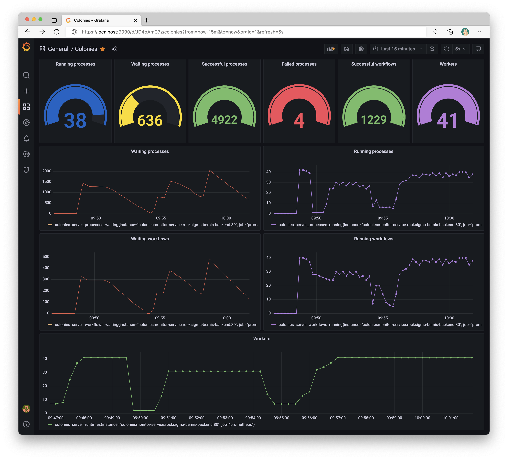

# Monitoring
The Colonies server has built-in support for Prometheus instrumentation. The development server starts a montitoring server at the port specified by the **COLONIES_MONITOR_PORT** environmental variable. 

```console
export COLONIES_MONITOR_PORT="21120"
```

Alternatively, an standalone monitoring server can be started:

```console
export COLONIES_SERVER_HOST="localhost"
export COLONIES_SERVER_PORT="50080"
export COLONIES_MONITOR_PORT="21120"
export COLONIES_MONITOR_INTERVAL="1"
export COLONIES_SERVER_ID="039231c7644e04b6895471dd5335cf332681c54e27f81fac54f9067b3f2c0103"
export COLONIES_SERVER_PRVKEY="fcc79953d8a751bf41db661592dc34d30004b1a651ffa0725b03ac227641499d"
export COLONIES_TLS="false"

colonies monitor start
```

## Prometheus configuration 
Use the following prometheus.yml to configure Prometheus. 
```yaml
global:
  scrape_interval: 15s
  external_labels:
    monitor: 'codelab-monitor'

scrape_configs:
  - job_name: 'prometheus'
    scrape_interval: 5s
    static_configs:
      - targets: ['localhost:21120']
```

## Start a Prometheus and a Grafana server
```console
docker run -p 9090:9090 -v /home/ubuntu/prometheus.yml:/etc/prometheus/prometheus.yml prom/prometheus
docker run -p 3000:3000 grafana/grafana-oss:latest-ubuntu
```

Log in into Grafana (http://localhost:3000) and add the Prometheus server as a new datasource.

## Metrics
The following metrics are exported:
- colonies_server_colonites
- colonies_server_executors
- colonies_server_processes_waiting
- colonies_server_processes_running
- colonies_server_processes_successful
- colonies_server_processes_failed
- colonies_server_workflows_waiting
- colonies_server_workflows_running
- colonies_server_workflows_successful
- colonies_server_workflows_failed


