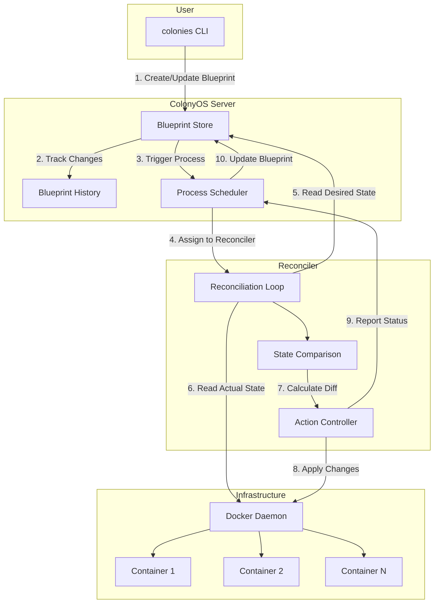
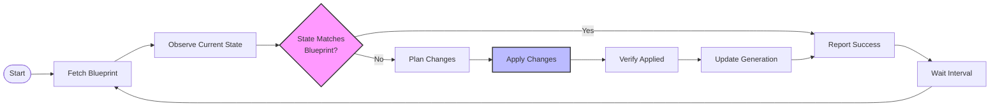
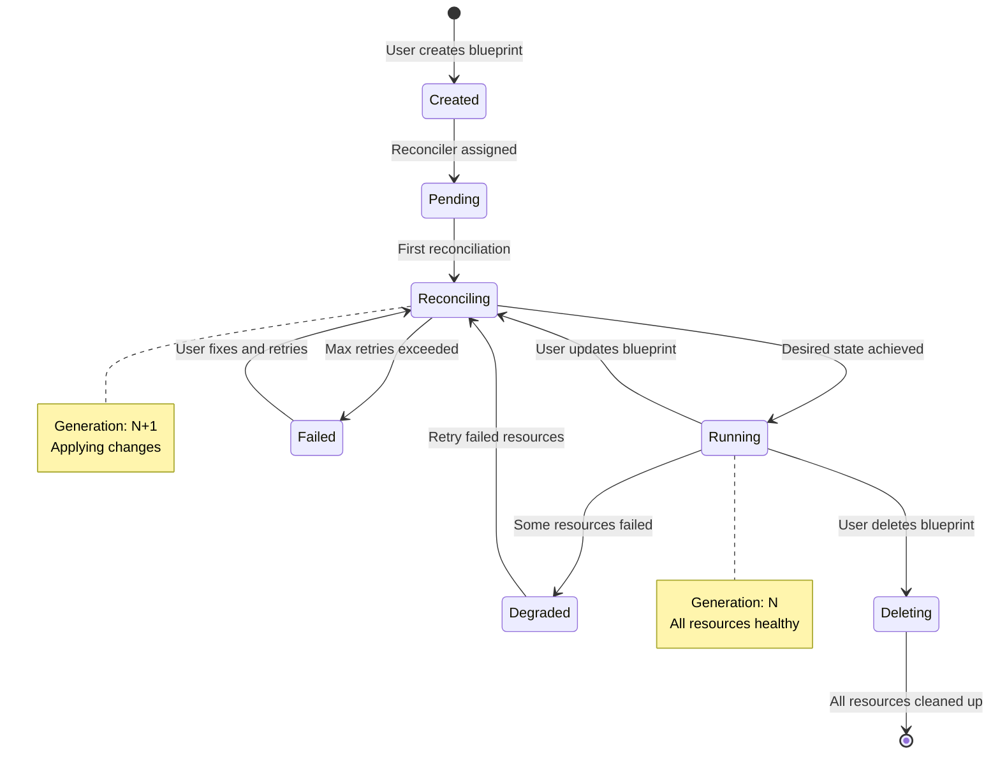
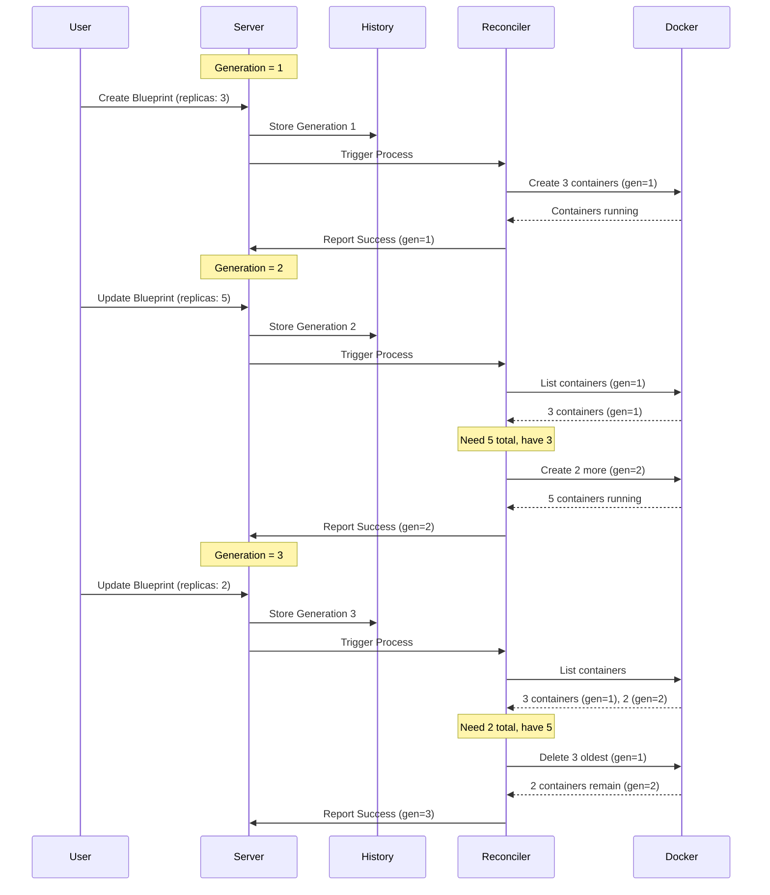
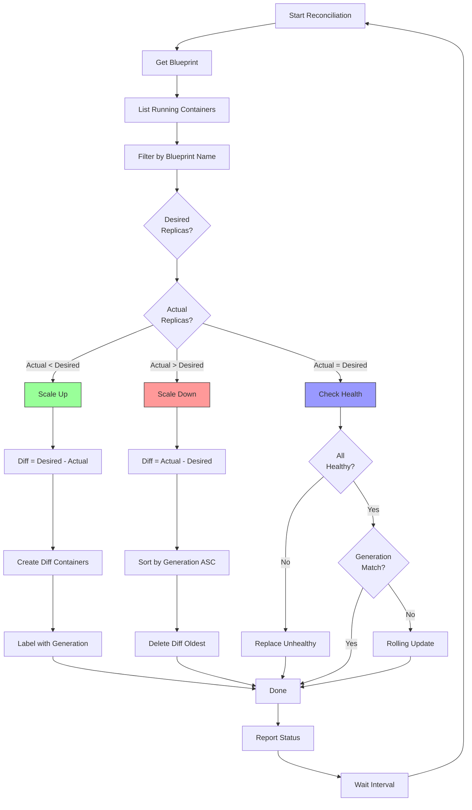
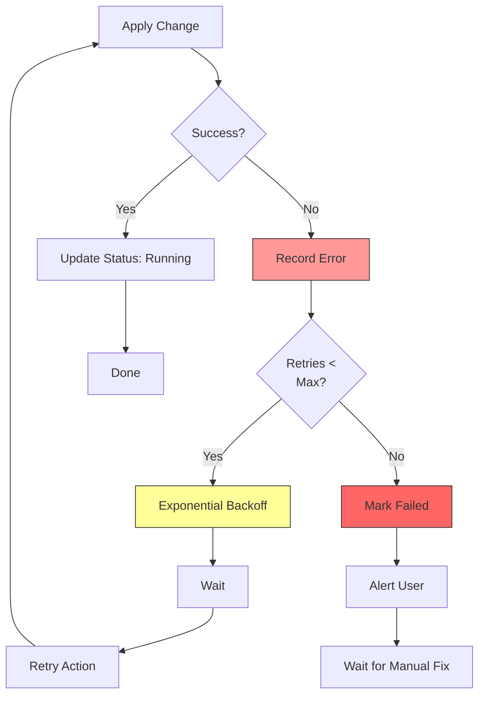
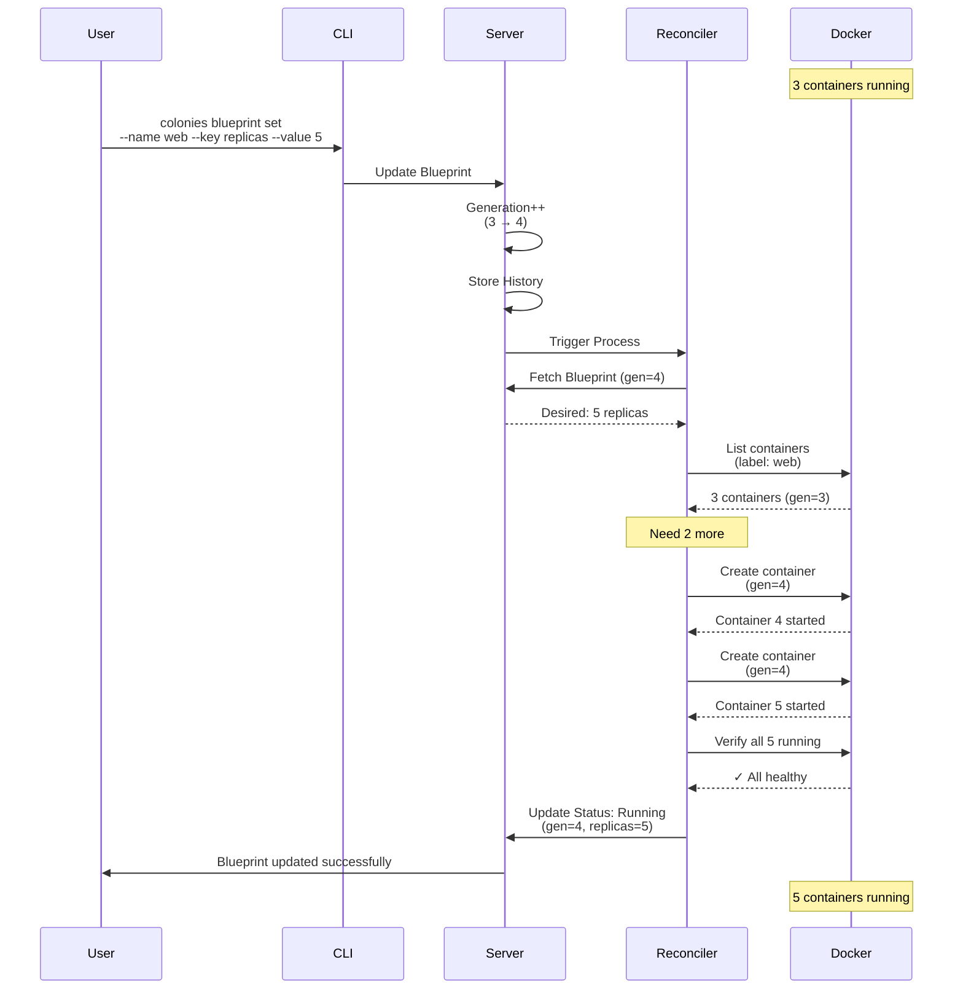

# Reconciliation in ColonyOS

## Overview

Reconciliation is a control loop pattern inspired by Kubernetes that continuously ensures the actual state of your system matches the desired state defined in blueprints. This document explains how reconciliation works in ColonyOS.

## What is Reconciliation?

Reconciliation is the process of:
1. Observing the current state of resources (containers, executors, etc.)
2. Comparing it with the desired state (defined in blueprints)
3. Taking actions to make the actual state match the desired state

This pattern provides:
- **Self-healing**: Automatically restart failed containers
- **Declarative management**: Describe what you want, not how to get there
- **Eventual consistency**: System converges to desired state over time

## Architecture



## Reconciliation Loop

The reconciliation loop runs continuously, ensuring system state matches blueprint definitions.



### Loop Steps

1. **Fetch Blueprint**: Read desired state from blueprint store
2. **Observe Current State**: Query infrastructure for actual state
3. **Compare**: Diff desired vs actual state
4. **Plan Changes**: Determine what actions to take
5. **Apply Changes**: Execute create/update/delete operations
6. **Verify**: Confirm changes were applied successfully
7. **Update Generation**: Increment generation counter
8. **Report Status**: Update blueprint status
9. **Wait**: Sleep before next iteration

## Blueprint Lifecycle



### Status Transitions

- **Created**: Blueprint exists but not yet assigned to reconciler
- **Pending**: Waiting for reconciler to pick up
- **Reconciling**: Actively applying changes
- **Running**: All resources match desired state
- **Degraded**: Some resources unhealthy or missing
- **Failed**: Unable to achieve desired state after retries
- **Deleting**: Cleaning up all resources

## Generation Tracking

Generations track blueprint versions and enable smart reconciliation.



### Generation Usage

**Label Containers**: Each container gets labeled with its generation
```json
{
  "colonies.managed": "true",
  "colonies.blueprint": "web-server",
  "colonies.generation": "5"
}
```

**Detect Drift**: Containers with old generations are outdated
```go
if container.Generation < blueprint.Generation {
    // Container needs update or replacement
}
```

**Rolling Updates**: Replace containers gradually
```go
// Delete oldest containers first
sort.By(container.Generation).Ascending()
```

## Reconciliation Logic

### State Comparison



### Reconciliation Actions

**1. Scale Up (Actual < Desired)**
```go
needed := blueprint.Spec.Replicas - len(runningContainers)
for i := 0; i < needed; i++ {
    container := CreateContainer(blueprint)
    container.Labels["colonies.generation"] = blueprint.Generation
    docker.Start(container)
}
```

**2. Scale Down (Actual > Desired)**
```go
excess := len(runningContainers) - blueprint.Spec.Replicas
sortByGeneration(runningContainers) // Oldest first
for i := 0; i < excess; i++ {
    docker.Stop(runningContainers[i])
    docker.Remove(runningContainers[i])
}
```

**3. Replace Unhealthy**
```go
for _, container := range runningContainers {
    if !container.Healthy() {
        docker.Stop(container)
        docker.Remove(container)
        newContainer := CreateContainer(blueprint)
        docker.Start(newContainer)
    }
}
```

**4. Rolling Update (Generation Mismatch)**
```go
for _, container := range runningContainers {
    if container.Generation < blueprint.Generation {
        docker.Stop(container)
        docker.Remove(container)
        newContainer := CreateContainer(blueprint)
        docker.Start(newContainer)
        time.Sleep(rolloutDelay) // Gradual rollout
    }
}
```

## Error Handling



### Retry Strategy

**Exponential Backoff**
```go
retries := 0
maxRetries := 5
baseDelay := 1 * time.Second

for retries < maxRetries {
    err := applyChange()
    if err == nil {
        break
    }

    delay := baseDelay * time.Duration(math.Pow(2, float64(retries)))
    time.Sleep(delay)
    retries++
}

if retries >= maxRetries {
    blueprint.Status = "Failed"
    blueprint.Error = err.Error()
}
```

## Example: Scaling Workflow



## Reconciliation Frequency

The reconciler runs on two triggers:

1. **Event-driven**: When blueprint is created/updated
2. **Periodic**: Every N seconds (default: 30s)

```mermaid
gantt
    title Reconciliation Timeline
    dateFormat ss
    axisFormat %S

    section Events
    Blueprint Created    :milestone, m1, 00, 0s
    User Updates         :milestone, m2, 15, 0s
    User Scales Down     :milestone, m3, 45, 0s

    section Reconciliation
    Initial Reconcile    :crit, r1, 00, 5s
    Periodic Check 1     :r2, 30, 2s
    Event-Driven (Update):crit, r3, 15, 4s
    Periodic Check 2     :r4, 60, 2s
    Event-Driven (Scale) :crit, r5, 45, 3s
```



### Configuration

```bash
# Set reconciliation interval
RECONCILE_INTERVAL=30s

# Set event trigger delay (debounce rapid changes)
RECONCILE_DEBOUNCE=5s

# Set max concurrent reconciliations
RECONCILE_WORKERS=5
```

## Best Practices

### 1. Idempotent Operations
Reconciliation should be safe to run multiple times:
```go
// ✓ Good - Idempotent
if !containerExists(name) {
    createContainer(name)
}

// ✗ Bad - Not idempotent
createContainer(name) // Fails if exists
```

### 2. Graceful Degradation
Handle partial failures gracefully:
```go
healthy := 0
for _, container := range containers {
    if container.IsHealthy() {
        healthy++
    }
}

if healthy >= desired * 0.7 { // 70% threshold
    status = "Degraded"
} else {
    status = "Failed"
}
```

### 3. Label Everything
Use labels for tracking and querying:
```go
labels := map[string]string{
    "colonies.managed": "true",
    "colonies.blueprint": blueprint.Name,
    "colonies.generation": strconv.Itoa(blueprint.Generation),
    "colonies.colony": blueprint.ColonyName,
}
```

### 4. Audit Changes
Log all reconciliation actions:
```go
log.Info("Reconciliation started",
    "blueprint", blueprint.Name,
    "generation", blueprint.Generation,
    "desired", desired,
    "actual", actual)
```

## Monitoring

Track reconciliation metrics:

```bash
# Check blueprint status
colonies blueprint get --name web-server

# View reconciliation history
colonies blueprint history --name web-server

# Monitor reconciler logs
docker logs -f docker-reconciler

# Check container generations
docker ps --filter label=colonies.blueprint=web-server \
  --format "{{.ID}} gen={{.Label \"colonies.generation\"}}"
```

## Troubleshooting

### Blueprint Stuck in Reconciling

**Check reconciler logs:**
```bash
docker logs docker-reconciler
```

**Verify reconciler is running:**
```bash
colonies executor ls | grep reconciler
```

**Check for resource constraints:**
```bash
docker stats
df -h  # Disk space
free -h  # Memory
```

### Containers Not Starting

**Check blueprint spec:**
```bash
colonies blueprint get --name myapp
```

**Verify image exists:**
```bash
docker pull <image-name>
```

**Check Docker daemon:**
```bash
docker info
docker system df
```

### Generation Mismatch

**List containers with generations:**
```bash
docker ps -a --filter label=colonies.blueprint=myapp \
  --format "table {{.ID}}\t{{.Status}}\t{{.Label \"colonies.generation\"}}"
```

**Force reconciliation:**
```bash
colonies blueprint set --name myapp --key replicas --value <current-value>
```

## See Also

- [Blueprints.md](Blueprints.md) - Complete blueprint documentation
- [SchemaValidation.md](SchemaValidation.md) - Schema validation guide
- [docker-reconciler/README.md](https://github.com/colonyos/executors/tree/main/docker-reconciler) - Docker Reconciler implementation
