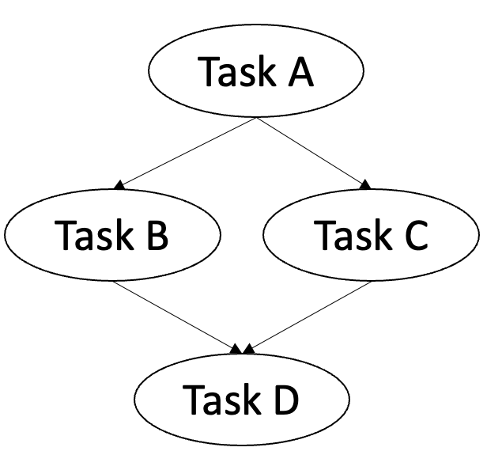

# Workflow
A workflow is collection of named process specifications where some specifications may have dependencies to other specifications. Once submitted to the Colonies server, the Colonies server will create the corresponding processes and add the processes to the database (queue). It will also set dependencies between the processes which will then form a Directed Acyclic Graph (DAG). 



The picture above depicts an example of a DAG. Task A has no depenecies and can thus start immediately. Task B and C have to wait for Task A to finish before they can start. Task D has to wait for Task B and C to finish. 

This workflow can be modelled as follows:
```json
[
    {
        "nodename": "task_a",
        "funcname": "echo",
        "args": [
            "task1"
        ],
        "conditions": {
            "executortype": "cli",
            "dependencies": null
        }
    },
    {
        "nodename": "task_b",
        "funcname": "echo",
        "args": [
            "task2"
        ],
        "conditions": {
            "executortype": "cli",
            "dependencies": [
                "task_a"
            ]
        }
    },
    {
        "nodename": "task_c",
        "funcname": "echo",
        "args": [
            "task3"
        ],
        "conditions": {
            "executortype": "cli",
            "dependencies": [
                "task_a"
            ]
        }
    },
    {
        "nodename": "task_d",
        "funcname": "echo",
        "args": [
            "task4"
        ],
        "conditions": {
            "executortype": "cli",
            "dependencies": [
                "task_b",
                "task_c"
            ]
        }
    }
]
```

## Submit a workflow 
Open another terminal (and *source devenv*).
```console
colonies workflow submit --spec examples/workflow/workflow.json

INFO[0000] Workflow submitted                            WorkflowID=8bc49205ae35e089b370c05cd2a110b84e72d5052c2ec3fb5bc4832274d9d1b1
```

```console
colonies workflow get --workflowid 8bc49205ae35e089b370c05cd2a110b84e72d5052c2ec3fb5bc4832274d9d1b1

Workflow:
+----------------+------------------------------------------------------------------+
| WorkflowID     | 8bc49205ae35e089b370c05cd2a110b84e72d5052c2ec3fb5bc4832274d9d1b1 |
| ColonyName       | 8bc49205ae35e089b370c05cd2a110b84e72d5052c2ec3fb5bc4832274d9d1b1 |
| State          | Waiting                                                          |
| SubmissionTime | 2022-05-31 16:23:13                                              |
| StartTime      | 0001-01-01 01:12:12                                              |
| EndTime        | 0001-01-01 01:12:12                                              |
+----------------+------------------------------------------------------------------+

Processes:
+-------------------+------------------------------------------------------------------+
| NodeName          | task_a                                                           |
| ProcessID         | 3a8e9299c76905c87f903b4fdcf4c5dbeb314659e2ed31d477dcb414e8fedf1f |
| ExecutorType      | cli                                                              |
| FuncName          | echo                                                             |
| Args              | task_a                                                           |
| State             | Waiting                                                          |
| WaitingForParents | false                                                            |
| Dependencies      | None                                                             |
+-------------------+------------------------------------------------------------------+

+-------------------+------------------------------------------------------------------+
| NodeName          | task_b                                                           |
| ProcessID         | 5fd0611d57fc567ce7aa7984424b1de749c32b20b92668b4755ade6ca62e19c2 |
| ExecutorType      | cli                                                              |
| FuncName          | echo                                                             |
| Args              | task_b                                                           |
| State             | Waiting                                                          |
| WaitingForParents | true                                                             |
| Dependencies      | task_a                                                           |
+-------------------+------------------------------------------------------------------+

+-------------------+------------------------------------------------------------------+
| NodeName          | task_d                                                           |
| ProcessID         | f46b7e84da0657cda3982282f5bef8b3c7429eff6b635cbce9bf93eb034e6705 |
| ExecutorType      | cli                                                              |
| FuncName          | echo                                                             |
| Args              | task_d                                                           |
| State             | Waiting                                                          |
| WaitingForParents | true                                                             |
| Dependencies      | task_b task_c                                                    |
+-------------------+------------------------------------------------------------------+

+-------------------+------------------------------------------------------------------+
| NodeName          | task_c                                                           |
| ProcessID         | bf5d93190967539133063d357bcd5d446d3e4fce41a6d110926de12129a64156 |
| ExecutorType      | cli                                                              |
| FuncName          | echo                                                             |
| Args              | task_c                                                           |
| State             | Waiting                                                          |
| WaitingForParents | true                                                             |
| Dependencies      | task_a                                                           |
+-------------------+------------------------------------------------------------------+
```

## Start a executor 
```console
./bin/unix_executor start   
```

```console
INFO[0000] Starting an executor                          BuildTime="2022-05-31T13:43:22Z" BuildVersion=a153cbf
INFO[0000] Saving executorID to /tmp/executorid
INFO[0000] Saving executorPrvKey to /tmp/executorprvkey
INFO[0000] Register a new Executor                       CPU= Cores=-1 GPU= GPUs=-1 Mem=-1 colonyID=4787a5071856a4acf702b2ffcea422e3237a679c681314113d86139461290cf4 executorID=d709c23a58cb883817e0fe38ae20f3f539b7b7c4f607cc16e2b927eb3c123a34 executorName=my_executor executorType=cli
INFO[0000] Approving Executor                            executorID=d709c23a58cb883817e0fe38ae20f3f539b7b7c4f607cc16e2b927eb3c123a34
INFO[0000] Executor now waiting for processes to be execute  BuildTime="2022-05-31T13:43:22Z" BuildVersion=a153cbf ServerHost=localhost ServerPort=50080
INFO[0000] Executor was assigned a process               processID=3a8e9299c76905c87f903b4fdcf4c5dbeb314659e2ed31d477dcb414e8fedf1f
INFO[0000] Lauching process                              Args="[task_a]" Func=echo
task_a
INFO[0000] Closing process as successful                 processID=3a8e9299c76905c87f903b4fdcf4c5dbeb314659e2ed31d477dcb414e8fedf1f
INFO[0000] Executor was assigned a process               processID=5fd0611d57fc567ce7aa7984424b1de749c32b20b92668b4755ade6ca62e19c2
INFO[0000] Lauching process                              Args="[task_b]" Func=echo
task_b
INFO[0000] Closing process as successful                 processID=5fd0611d57fc567ce7aa7984424b1de749c32b20b92668b4755ade6ca62e19c2
INFO[0000] Executor was assigned a process               processID=bf5d93190967539133063d357bcd5d446d3e4fce41a6d110926de12129a64156
INFO[0000] Lauching process                              Args="[task_c]" Func=echo
task_c
INFO[0000] Closing process as successful                 processID=bf5d93190967539133063d357bcd5d446d3e4fce41a6d110926de12129a64156
INFO[0000] Executor was assigned a process               processID=f46b7e84da0657cda3982282f5bef8b3c7429eff6b635cbce9bf93eb034e6705
INFO[0000] Lauching process                              Args="[task_d]" Func=echo
task_d
INFO[0000] Closing process as successful                 processID=f46b7e84da0657cda3982282f5bef8b3c7429eff6b635cbce9bf93eb034e6705
```

Note that the order the processes are executed. Also, try to start another executor and you will see that both executors will execute processes.
