# SharedMem Design

SharedMem provides channel message replication across multiple ColonyOS server nodes in a cluster. It enables real-time streaming to work correctly when clients and executors connect to different servers behind a load balancer.

## Advantages

### Subscribers Can Reside on Any Server

The key advantage of SharedMem is that clients can subscribe to channels on any ColonyOS server in the cluster, regardless of which server the executor is connected to.

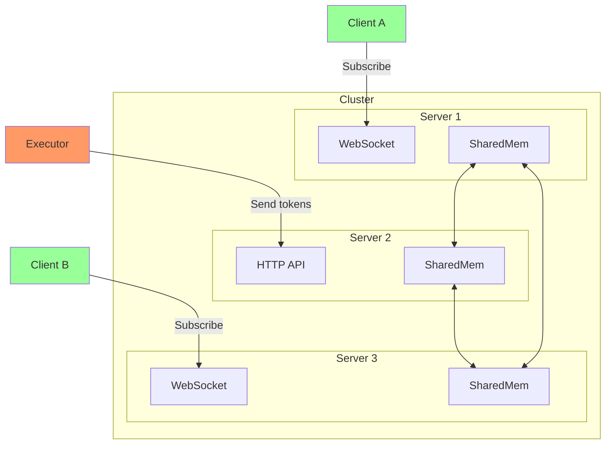

**Benefits:**

1. **No sticky sessions required** - Load balancer can use simple round-robin
2. **True high availability** - If one server fails, clients reconnect to another and continue receiving messages
3. **Horizontal scaling** - Add more servers without routing complexity
4. **No single point of failure** - Any server can handle any client
5. **Simplified client logic** - Clients don't need to discover or track which server holds their channel

### No WebSocket Tunneling Between Servers

Alternative architectures require proxying WebSocket connections between servers. SharedMem avoids this:

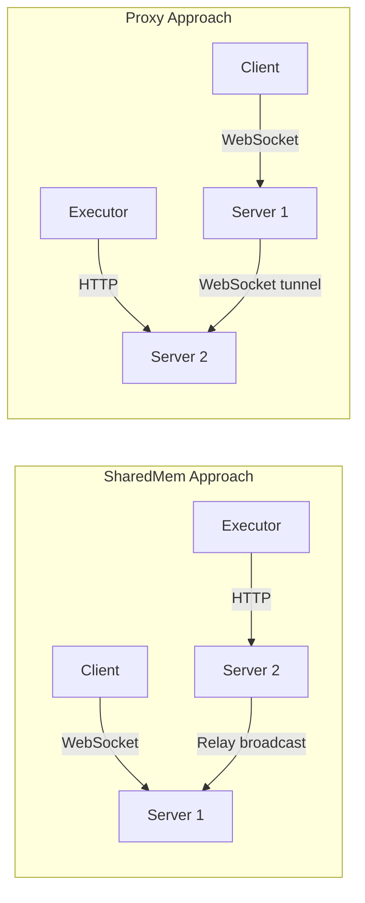

**SharedMem advantages over proxy approach:**
- No long-lived connections between servers
- Simpler failure handling
- Lower latency (no proxy hop)
- Each server maintains its own WebSocket connections

### Consistent Hashing Not Required

Without SharedMem, you would need consistent hashing to route requests:

| Approach | Routing Complexity | HA Support | Load Balancer |
|----------|-------------------|------------|---------------|
| SharedMem | None | Full | Simple round-robin |
| Consistent Hashing | Process ID header | Partial | Custom config |
| Sticky Sessions | Session cookies | Limited | Stateful LB |

### Decoupled Read and Write Paths

Executors and clients use different protocols that are independently scalable:

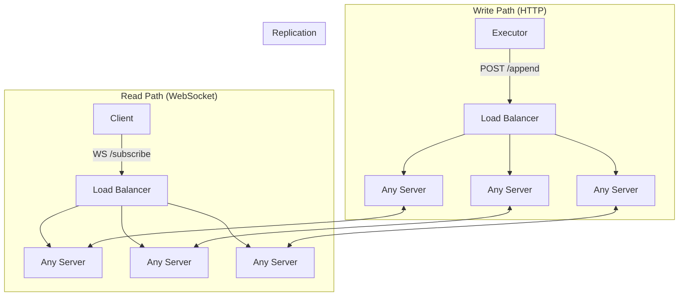

## Problem

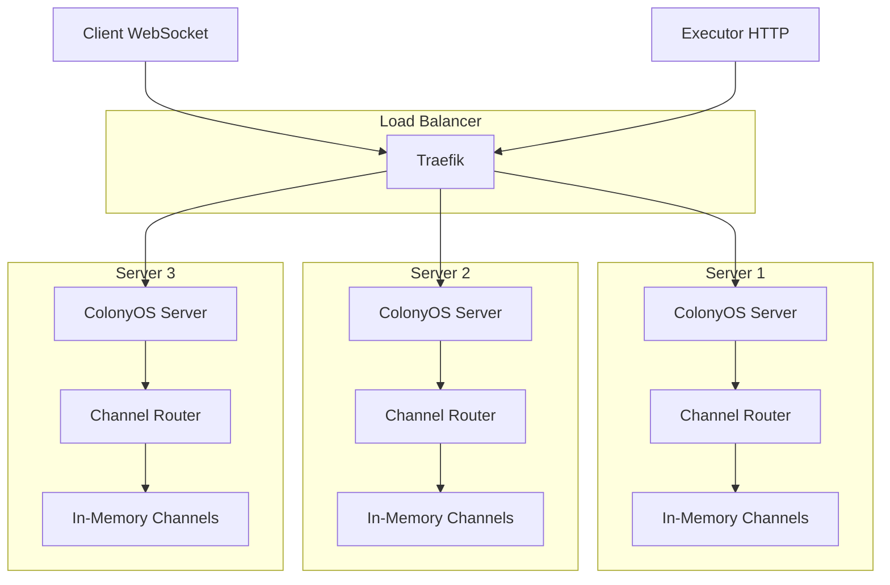

When a client subscribes via WebSocket to Server 1 and an executor sends messages via HTTP to Server 2, the messages are stored in Server 2's memory and never reach the client on Server 1.

## Solution

SharedMem broadcasts all channel messages to all servers via the existing RelayServer infrastructure. Each server maintains a local copy of channel data.

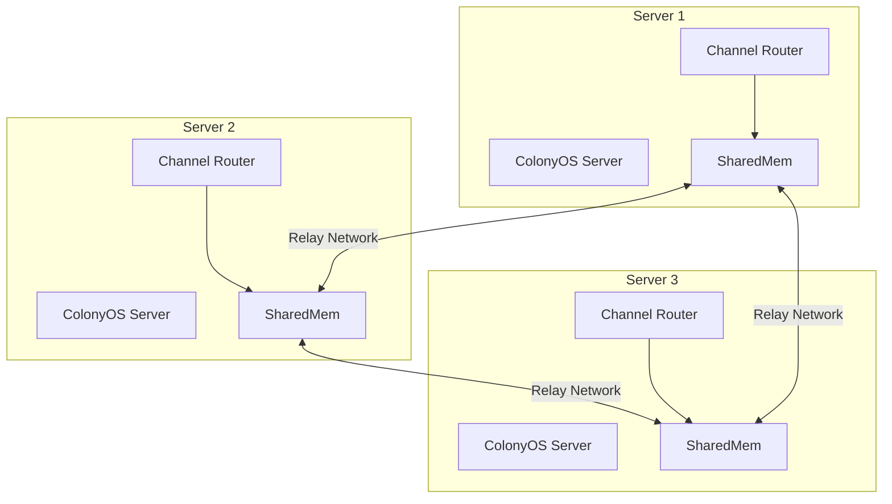

## Architecture

```mermaid
classDiagram
    class Network {
        <<interface>>
        +Broadcast(msg []byte) error
    }

    class SharedMem {
        -network Network
        -receiveChan chan *ChannelMessage
        -activeProcesses map[string]struct{}
        -mu sync.RWMutex
        -closed bool
        +NewSharedMem(network, bufferSize) *SharedMem
        +Broadcast(processID, channelName, entry) error
        +Receive() chan *ChannelMessage
        +ReceiveWithContext(ctx) *ChannelMessage
        +HandleIncoming(data []byte) error
        +GetActiveProcesses() []string
        +CloseProcess(processID)
        +ActiveProcessCount() int
        +Close()
    }

    class ChannelMessage {
        +ProcessID string
        +ChannelName string
        +Entry *MsgEntry
    }

    class RelayNetwork {
        +Broadcast(msg []byte) error
    }

    Network <|.. RelayNetwork
    SharedMem --> Network
    SharedMem --> ChannelMessage
```

## Data Flow

### Executor Sending Message

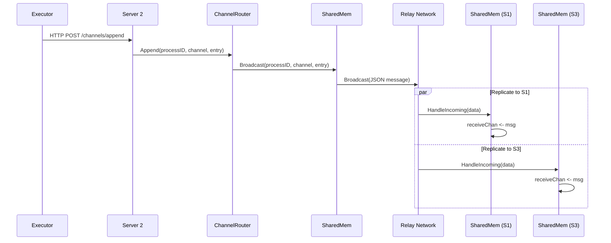

### Client Receiving Messages

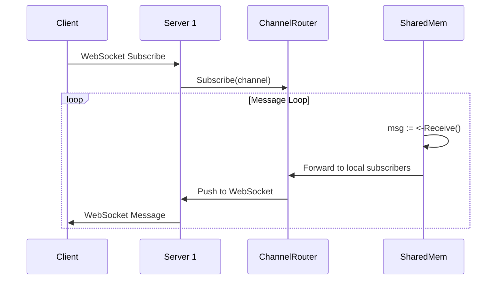

## Process Tracking and GC

SharedMem tracks active processes to enable garbage collection. When messages are broadcast or received, the process ID is automatically tracked.

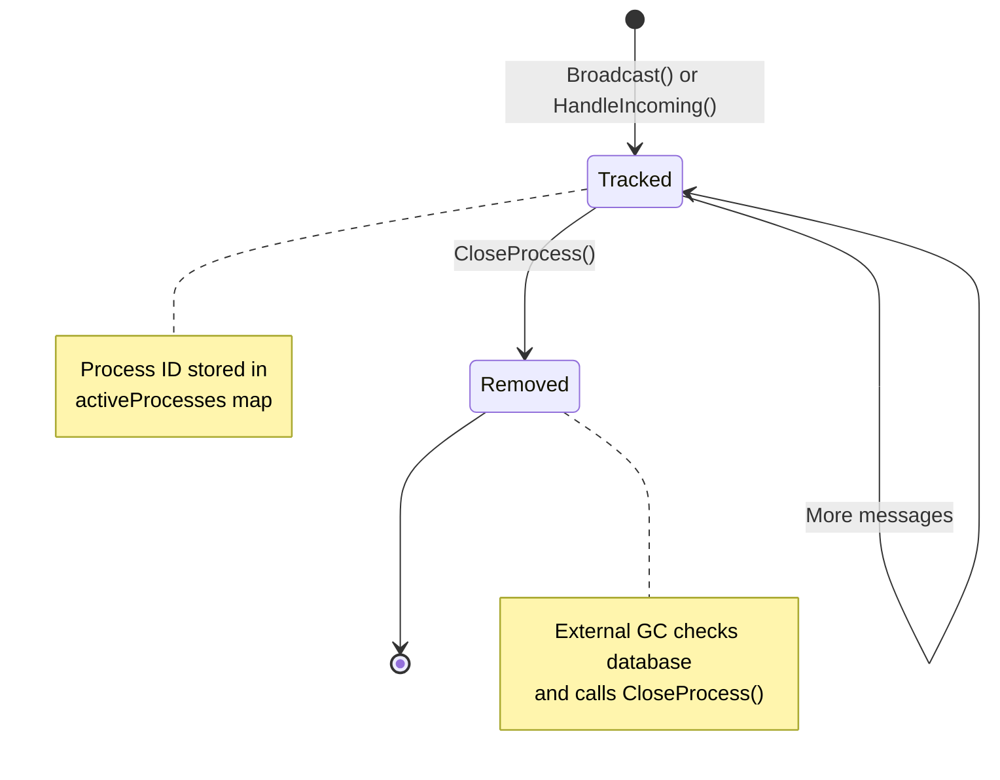

### External GC Pattern

GC runs outside SharedMem, typically as a periodic routine:

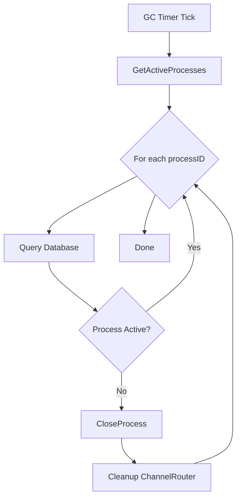

```go
// External GC routine (runs every 5 minutes)
func gcRoutine(sharedMem *SharedMem, db ProcessDatabase, router *Router) {
    processes := sharedMem.GetActiveProcesses()
    for _, processID := range processes {
        process, _ := db.GetProcessByID(processID)
        if process == nil || process.State == core.SUCCESS || process.State == core.FAILED {
            sharedMem.CloseProcess(processID)
            router.CleanupProcess(processID)
        }
    }
}
```

## Thread Safety

All SharedMem operations are thread-safe:

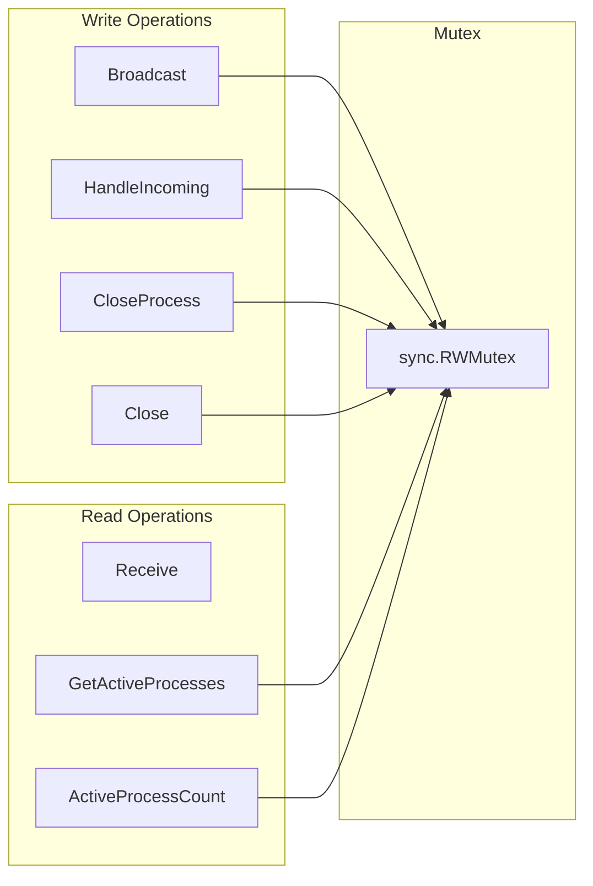

- Write operations acquire exclusive lock (`mu.Lock()`)
- Read operations acquire shared lock (`mu.RLock()`)
- `Receive()` returns a channel, no lock needed for reading from channel

## Integration Points

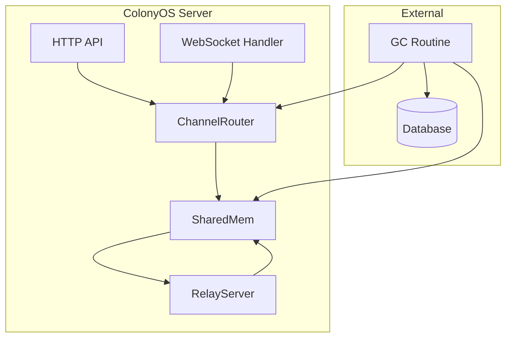

1. **ChannelRouter** calls `SharedMem.Broadcast()` when appending messages
2. **RelayServer** calls `SharedMem.HandleIncoming()` when receiving from other nodes
3. **ChannelRouter** reads from `SharedMem.Receive()` to get replicated messages
4. **GC Routine** uses `GetActiveProcesses()` and `CloseProcess()` for cleanup

## Message Format

```json
{
  "processid": "process-123",
  "channelname": "output",
  "entry": {
    "sequence": 1,
    "inreplyto": 0,
    "timestamp": "2024-01-15T10:30:00Z",
    "senderid": "executor-456",
    "payload": "base64-encoded-data",
    "type": "data"
  }
}
```

## Configuration

| Parameter | Default | Description |
|-----------|---------|-------------|
| bufferSize | 1000 | Size of receive channel buffer |

## Assumptions

### Single Writer per Channel Direction

Each channel direction has exactly one writer:
- **Input channel**: Only the client/submitter writes
- **Output channel**: Only the executor writes

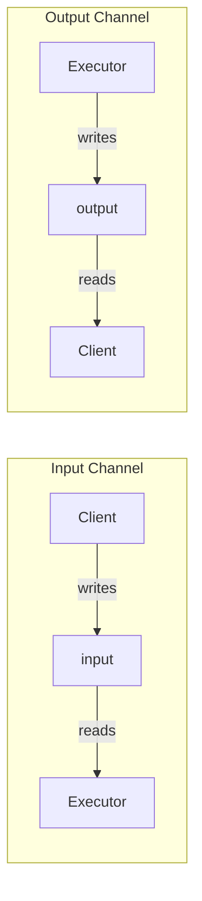

**Implication**: No reordering buffer needed. TCP guarantees ordered delivery from a single sender.

### TCP Ordered Delivery

The relay network uses HTTP/TCP which guarantees:
- Messages from a single sender arrive in order
- No duplicate detection needed
- No sequence gap handling needed

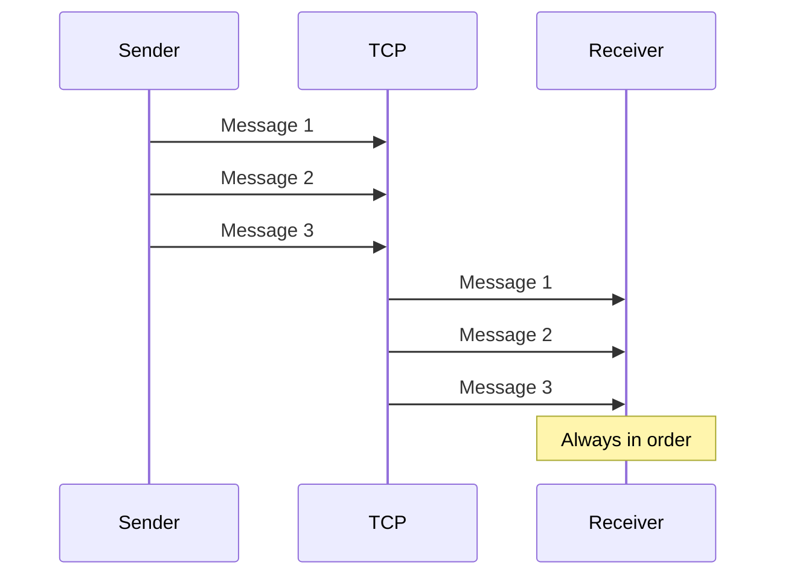

### Channels are Process-Scoped

- Channels belong to a single process
- When a process closes (SUCCESS/FAILED), its channels can be cleaned up
- Channel IDs are deterministic: `{processID}_{channelName}`

### Eventual Consistency

- Messages are broadcast asynchronously
- Brief inconsistency window between servers is acceptable
- Clients may miss messages if they connect after broadcast but before replication completes

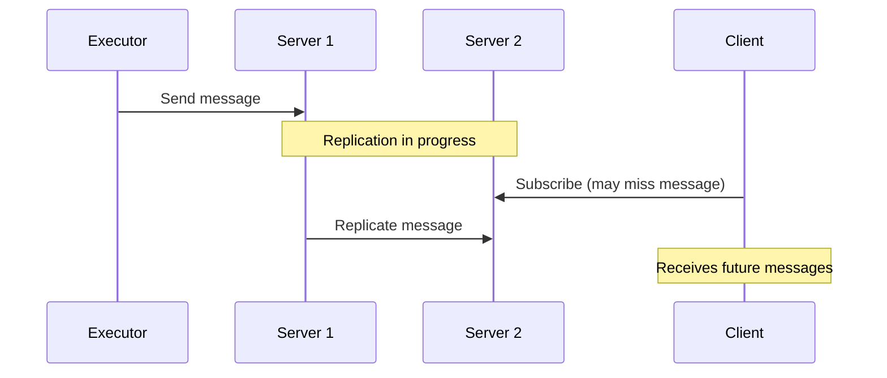

**Mitigation**: Clients can request historical messages via `ReadAfter()` after subscribing.

### Non-Blocking Broadcast

- `HandleIncoming()` uses non-blocking channel send
- If receive buffer is full, messages are dropped
- Slow consumers lose messages rather than blocking the system

### Process Lifecycle Managed Externally

SharedMem does not:
- Query the database for process state
- Subscribe to process events
- Automatically clean up closed processes

External GC routine is responsible for:
- Periodically checking process state in database
- Calling `CloseProcess()` for terminated processes
- Cleaning up ChannelRouter

### Idempotent Process Tracking

- Same process ID can be tracked multiple times (no-op)
- `CloseProcess()` on non-existent process is safe (no-op)
- `GetActiveProcesses()` returns snapshot, may be stale

### No Message Persistence

- SharedMem is purely in-memory
- Server restart loses all tracked processes
- Messages are not persisted to disk
- Relies on ChannelRouter for local channel storage

### All Servers Receive All Messages

- Every message is broadcast to every server
- No filtering by process ID or channel at network level
- Each server filters locally based on tracked processes

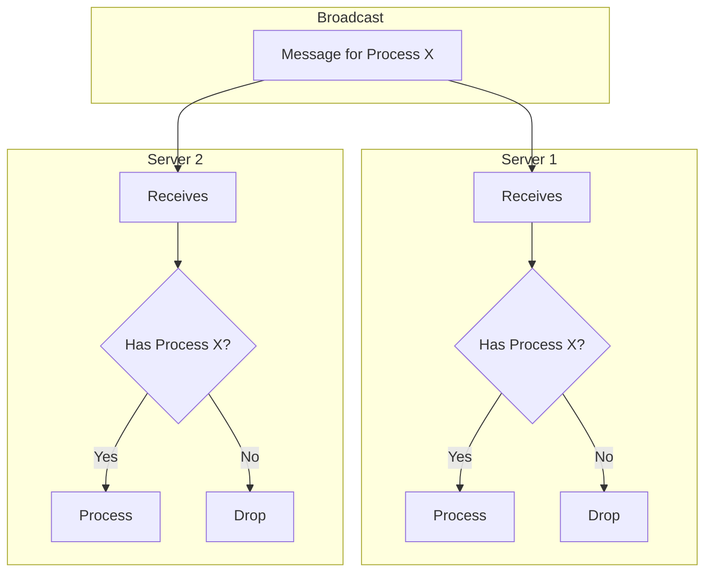

## Error Handling

- **Buffer full**: Messages dropped silently (non-blocking send)
- **Invalid JSON**: Returns error from `HandleIncoming()`
- **Closed SharedMem**: Operations return early, no panic

## Alternative Designs Considered

Several alternative architectures were evaluated before choosing the relay-based SharedMem approach.

### Alternative 1: Consistent Hashing with Header

Route all requests for a process to the same server using a custom HTTP header.

```mermaid
flowchart TB
    subgraph "Client"
        C[Client SDK]
    end

    subgraph "Load Balancer"
        LB[Nginx/Traefik]
        Hash[Hash X-Process-ID]
    end

    subgraph "Servers"
        S1[Server 1]
        S2[Server 2]
        S3[Server 3]
    end

    C -->|X-Process-ID: abc123| LB
    LB --> Hash
    Hash -->|hash(abc123) mod 3 = 1| S2
```

**Implementation:**
- Client SDK adds `X-Process-ID` header to all channel requests
- Load balancer uses consistent hashing on header value
- All requests for same process go to same server

**Pros:**
- No inter-server communication needed
- Simple server implementation (single-node channels)
- Lower latency (no replication delay)
- Memory efficient (channels only on one server)

**Cons:**
- Requires load balancer support (Traefik doesn't support header-based hashing)
- Client SDK changes required
- Single point of failure per process
- Server failure loses all its channels
- Rebalancing on server add/remove is complex
- WebSocket connections must also be routed consistently

### Alternative 2: Server-Side Proxy Router

Each server acts as a proxy, forwarding requests to the responsible server.

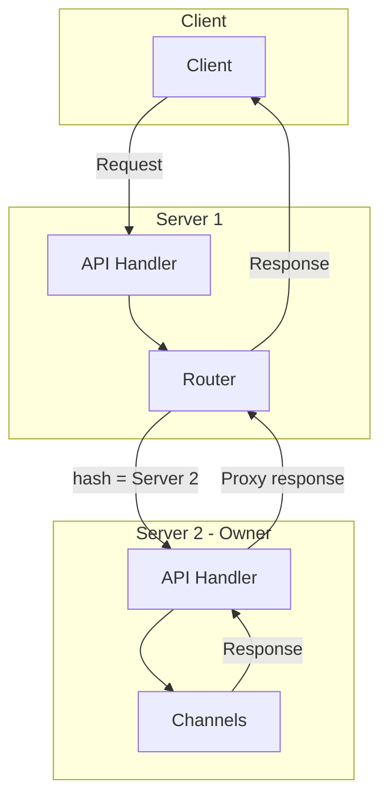

**Implementation:**
- Each server has routing table of all servers
- Incoming request is hashed to determine owner
- If not owner, proxy to correct server
- Response proxied back to client

**Pros:**
- No load balancer changes needed
- Transparent to clients
- Channels stored on single server (memory efficient)

**Cons:**
- Added latency for proxied requests
- Complex connection management between servers
- WebSocket proxying is particularly complex
- Single point of failure per process
- Server failure handling is complex
- Potential bottleneck on proxy server

### Alternative 3: WebSocket Tunneling

Tunnel WebSocket connections between servers when client and executor are on different servers.

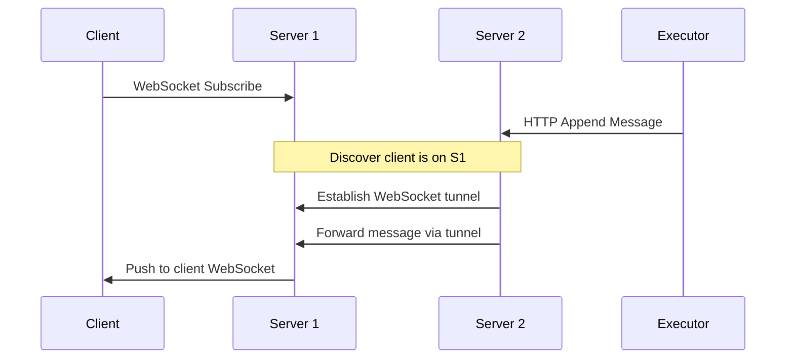

**Implementation:**
- Track which server each client is connected to
- When message arrives, look up client's server
- Establish/reuse WebSocket between servers
- Forward messages through tunnel

**Pros:**
- Messages only sent to servers with subscribers
- Lower bandwidth than broadcast

**Cons:**
- Complex connection management
- Long-lived connections between servers
- Connection pooling needed
- Failure handling is complex
- Discovery mechanism needed
- Higher latency than local delivery

### Alternative 4: Database-Backed Channels

Store all channel messages in the database (TimescaleDB).

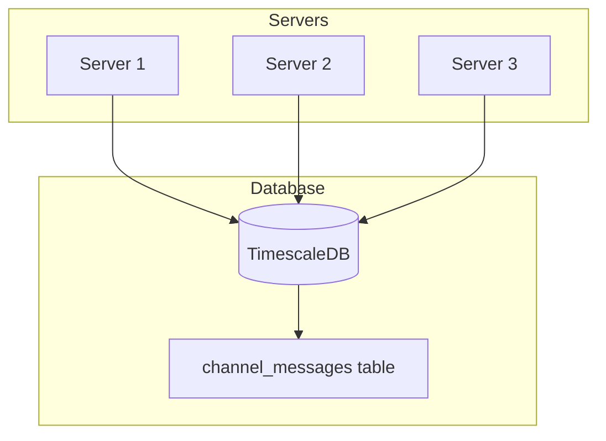

**Implementation:**
- All channel messages written to database
- Subscribers poll or use LISTEN/NOTIFY
- Database handles replication

**Pros:**
- Built-in persistence
- Leverages existing infrastructure
- Natural consistency model
- Survives server restarts

**Cons:**
- Higher latency (database round-trip)
- Database becomes bottleneck for streaming
- Not designed for high-frequency small messages
- LISTEN/NOTIFY has limitations
- Polling is inefficient
- Storage costs for ephemeral data

### Design Comparison Matrix

| Aspect | SharedMem (Chosen) | Consistent Hash | Proxy Router | WS Tunnel | Database |
|--------|-------------------|-----------------|--------------|-----------|----------|
| **Latency** | Low | Lowest | Medium | Medium | High |
| **Complexity** | Medium | Low | High | High | Low |
| **HA** | Full | None | None | Partial | Full |
| **LB Changes** | None | Required | None | None | None |
| **Client Changes** | None | Required | None | None | None |
| **Memory** | High (replicated) | Low | Low | Low | N/A |
| **Bandwidth** | High (broadcast) | Low | Medium | Low | Low |
| **Failure Recovery** | Automatic | Manual | Complex | Complex | Automatic |

### Why SharedMem Was Chosen

```mermaid
flowchart TD
    R1[Requirement: No LB changes] --> X1[Eliminates Consistent Hash]
    R2[Requirement: True HA] --> X2[Eliminates Proxy & Tunnel]
    R3[Requirement: Low latency] --> X3[Eliminates Database]
    R4[Requirement: Simple client] --> X4[Eliminates Consistent Hash]

    X1 --> SM[SharedMem]
    X2 --> SM
    X3 --> SM
    X4 --> SM

    SM --> A1[Accept: Higher memory usage]
    SM --> A2[Accept: Broadcast bandwidth]
```

**Key factors:**

1. **Traefik limitation** - Production uses Traefik which doesn't support header-based consistent hashing, eliminating Alternative 1

2. **True HA requirement** - System must survive server failures without losing active streams, eliminating Alternatives 2 and 3

3. **Simplicity** - No changes to load balancer or client SDK required

4. **Acceptable tradeoffs** - Higher memory and bandwidth usage is acceptable for the cluster size (3 servers)

## Design Session Prompts

This section documents the key prompts and questions from the design session that led to this architecture.

### Problem Discovery

> "there is however, an interesting problem here"
> "what happens if the executor and client connect to different colonies servers"

This identified the core problem: 3 ColonyOS servers behind a load balancer with in-memory channels causing message loss when executor and client connect to different servers.

### Initial Approach - Client-Side Routing

> "is there a way in kubernetes to route all requests (websockets, http) to the same colonies server replica? some kind of consistent hashing/sticky session approach?"

> "if we go for 1, then the ingress needs to know the id of the replica as well? how should this id look like?"

> "take look at /home/johan/dev/github/colonyos/colonies/pkg/client/client.go, what is the most convient way to implement this without changing all client calls?"

Led to implementing X-Process-ID header in the Go client SDK.

### Traefik Limitation

> "i am using traefik, is that a problem"

Discovery that Traefik doesn't support header-based consistent hashing, unlike nginx. This eliminated the client-side routing approach.

> "ok, restore all changed files"

All header-based routing changes were reverted.

### Architecture Discussion

> "lets talk how we can solve this problem, do not edit any code, i am considering implementing a shared memory based on the RelayServer/EventHandler already used in colonies server"

Shifted focus to server-side replication using existing relay infrastructure.

### Ordering Requirements

> "regarding the ordering, client set the sequence id, it is assumed that there is only one writer to a channel, but an executor or other client may reply to a certain message with a certain sequence number"

> "the colonies server, but buffer and wait for the next message, they need to be delivered in order to clients"

Clarified ordering requirements and single-writer assumption.

### Timeout Handling

> "timeout, and then close the channel after a timeout set in pkg/constants"

Discussed timeout behavior for channel subscriptions.

### Alternative Architecture

> "the alternative architecture, is to implement a router and use consistent hashing to select which colonies server should be responsible for a certain process id, which architecture is better?"

> "I think something like this might work: [code example for HandleAssignProcess proxy] but the client connection might need to become a bottleneck if it has to be established for every token?"

Evaluated proxy-based routing approach.

> "an alternative design might be to use the relay server?"
> "but it uses also http: /home/johan/dev/github/colonyos/colonies/pkg/cluster"

Explored using existing RelayServer for replication.

> "another idea, can I add a proxy in front on /api that intercepts the request and redirects it to a certain replica (consistent hashing) if a certain header is set in the request, basically making each colonies server work as a proxy?"

Considered server-as-proxy architecture.

### WebSocket Understanding

> "explain how websocket works for channels?"
> "where is that code? /colonies/pkg/server/handlers/realtime"

Deep dive into existing WebSocket implementation.

### Final Architecture Decision

> "I think this is the best solution, it could be reused for other applications, e.g. caching?"

> "but a colonies server will need to keep the connection open to another colonies server and reuse the connection efficiently"

> "the most robust solution seems to be to implement a shared memory and broadcast all channel data"

Decision to use relay-based broadcast replication.

### GC Design

> "may be periodically scan the database for closed processes or is it better to subscribe on process events? Cleanup broadcast - When process closes, cleanup on all servers"

> "yes, and also periodically scan the database to further simplify the controller, no pubsub is needed to manage process lifecycle, that can be a garbage collection routine running with a long interval, e.g. every 5 minutes, memory overhead would be minimal"

Decided on periodic GC scan instead of event subscription.

### Key Advantage

> "the advantage of this solution is that clients can subscribe on any colonies server and there is no need to tunnel websocket traffic between servers"

Identified the main benefit of the SharedMem approach.

### Component Design

> "almost, I want this to be a standalone component, call it shared_mem.go that can be tested separately, e.g. test re-ordering logic, timeout etc. But who will use the SharedMem, channel/router.go?"

Decision to make SharedMem a standalone, testable component.

### Interface Simplification

> "why does it need to handle subscribe?"
> "the network don't need Subscribe(handler func(msg []byte)) right?"

Simplified Network interface to just `Broadcast()`.

### Reordering Removal

> "the reorder should only be done if there is a gap, I think this will never happen, if there is only one writer, e.g. the ollama executor?"
> "then we can remove the reorder function from the design"

Removed reordering buffer based on single-writer assumption.

### Implementation Request

> "write it to /home/johan/dev/github/colonyos/colonies/pkg/channel/sharedmem.go and implement it and comprehensive tests with go routines"

Triggered implementation of SharedMem.

### Receive Channel Design

> "i think it would be better if the Receive return a channel, then it also becomes easier to handle timeout e.g. via a context"
> "then it also not blocking"

Changed from callback to channel-based receive for non-blocking operation.

### GC Location

> "the GC should be outside the sharedmem"

Moved GC logic outside SharedMem, keeping it simple with just `GetActiveProcesses()` and `CloseProcess()`.

### Process Tracking

> "no, this is not what I wanted, I want a way to iterate over all open channels and then via an interface be able to externally probe a database/system, and then close a process, this needs to be thread safe"

Final design for external GC with thread-safe process tracking.

### Documentation

> "Perfect, can you document the design in SharedMemDesign.md in channel package? mermaid diagrams"
> "also document all assumptions, e.g. one sender only"
> "subscribers can reside on any colonies server, document advantages"
> "also document alternative design also discussed in the chat session in the end of the document, add pros and cons"
> "can you also write down all prompts in the document?"

Documentation requests leading to this comprehensive design document.
